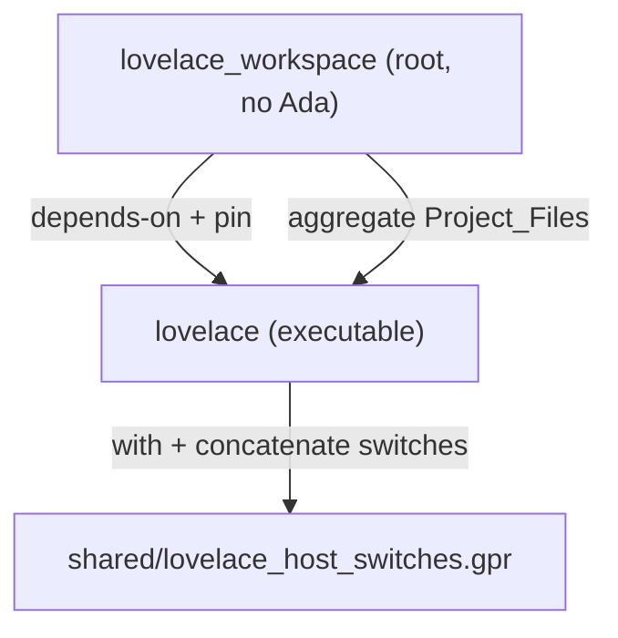

# Host Alire bootstrap

#1 — [Bootstrap lovelace CLI crate, shared host GPR, and workspace aggregate](https://github.com/sanelli/lovelace/issues/1)

Branch: `feature/1-host-alire-bootstrap`

Do not scaffold `compiler/`, `common/`, other host crates, nested tests, or CLI behavior.

The repo has rules and a README, but no `alire.toml`, `.gpr`, or Ada sources yet.

## 1. Create GitHub issue

Done: [#1](https://github.com/sanelli/lovelace/issues/1).

## 2. Create feature branch

Done: `feature/1-host-alire-bootstrap`.

## 3. Save the plan

Done: [`.cursor/plans/1-host-alire-bootstrap.plan.md`](.cursor/plans/1-host-alire-bootstrap.plan.md).

## 4. Shared host switches (not a crate)

Create [`shared/lovelace_host_switches.gpr`](shared/lovelace_host_switches.gpr) as an abstract project with no sources. Export `Ada_Compiler_Switches` so host crates concatenate it and do not copy the list.

- `-gnat2022`, `-gnatwae`, `-gnato`, `-fstack-check`
- `-gnatyy` plus extras `-gnatyABDdIoOSuxz` and `-gnatyM79`
- Omit `-gnatyg`, `-gnatyN`, `-gnatyC`

Crate `alire.toml` files: `"*".style_checks = "No"` so Alire cannot weaken the shared GPR. Keep Alire profiles for `-g` / `-O*` / contracts only.

## 5. `lovelace` executable crate

Hand-write (no extra `alr init` skeleton):

- [`lovelace/alire.toml`](lovelace/alire.toml) — name `lovelace`, MIT, author Stefano Anelli, `executables = ["lovelace"]`, no sibling `depends-on`, `auto-gpr-with = false`
- [`lovelace/lovelace.gpr`](lovelace/lovelace.gpr) — application project; `with` `config/lovelace_config.gpr` and `../shared/lovelace_host_switches.gpr`; concatenate `Lovelace_Config.Ada_Compiler_Switches & Lovelace_Host_Switches.Ada_Compiler_Switches`; `Main` `lovelace.adb`
- [`lovelace/src/lovelace.adb`](lovelace/src/lovelace.adb) — `procedure Lovelace is begin null; end Lovelace;`

No nested `lovelace/tests`. No CLI docs.

## 6. Root thin aggregate `lovelace_workspace`

- Root [`alire.toml`](alire.toml) — crate `lovelace_workspace`; `[[depends-on]] lovelace = "*"` and `[[pins]] lovelace = { path = "lovelace" }` only. No `project-files` array of component GPRs.
- [`lovelace_workspace.gpr`](lovelace_workspace.gpr) — `aggregate project` with `Project_Files` `("lovelace/lovelace.gpr")`. If Alire config `with`s cannot sit on an aggregate, use the minimal GPR gprbuild accepts (still one file, still the pin graph).

## 7. Ignore build trees

Extend [`.gitignore`](.gitignore) for `**/alire/`, `**/obj/`, `**/bin/`, `**/config/`. Optionally two README lines: `alr build` at root, or `alr -C lovelace run`.

## 8. Verify the build

Done. With `LIBRARY_PATH` including the macOS SDK `usr/lib` (needed for linking with the Alire GNAT toolchain on this host), `alr build` at the repo root and `alr -C lovelace build` both succeed; `lovelace/bin/lovelace` runs and exits 0. Compile line includes `-gnat2022`, `-gnatwae`, `-gnato`, `-fstack-check`, `-gnatyy`, `-gnatyABDdIoOSuxz`, `-gnatyM79`.

## 9. Run all tests

Done. No nested AUnit test crates exist in the repository; nothing to run.

## 10. Push and open a PR

Done. Branch pushed; PR [#2](https://github.com/sanelli/lovelace/pull/2) opened (closes #1).
