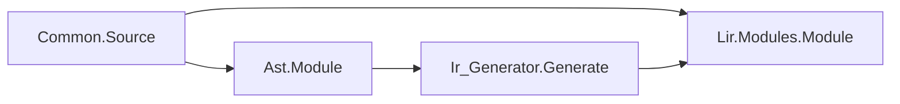

# Compiler IR Generator (AST → LIR) with shared source origins

#11 — [Compiler IR Generator: AST→LIR with shared source origins](https://github.com/sanelli/lovelace/issues/11)

Branch: `feature/11-compiler-ir-generator` (linked to #11; created from `main` via `gh issue develop`).

Plan file: [`.cursor/plans/11-compiler-ir-generator.plan.md`](11-compiler-ir-generator.plan.md).

Depends on landed parser ([#9](https://github.com/sanelli/lovelace/issues/9)) and LIR crate ([#7](https://github.com/sanelli/lovelace/issues/7)). Branch from current `main` only.

## Locked decisions

### Shared source locations (`lovelace_common`)

- **Move** [`Lovelace.Compiler.Source`](../../compiler/src/lovelace-compiler-source.ads) → **`Lovelace.Common.Source`** (`common/src/lovelace-common-source.ads` / `.adb`).
- Same public API: `Source_Position`, `Source_Span`, refcounted `Shared_Filename`, `Filename_Option`, `Absent_Filename`, `From_Utf_8`, `Some_Filename`, `Same_Storage`.
- **Delete** the compiler package after migration (no forever-thin re-export under `Lovelace.Compiler.Source`).
- Update every compiler `with` / type reference (AST, Tokens, Tokenizer, Parser, tests) to `Lovelace.Common.Source`.
- Update docs that name `Lovelace.Compiler.Source` ([`docs/tokenizer.md`](../../docs/tokenizer.md), etc.).
- Add focused AUnit coverage under [`common/tests`](../../common/tests) for span fields and filename sharing (`Same_Storage`).
- Rationale: `lovelace_lir` may depend only on `lovelace_common`; LIR cannot `with` compiler packages.

### LIR original positions (in-memory)

- Extend [`Lovelace.Lir.Modules.Module`](../../lir/src/lovelace-lir-modules.ads) and [`Lovelace.Lir.Subroutines.Subroutine`](../../lir/src/lovelace-lir-subroutines.ads) with **optional** origin metadata using `Lovelace.Common.Source`.
- **Module origin fields:** optional `Name_Span`, optional whole-unit `Span`, optional `Filename` (same shape as AST module).
- **Subroutine origin fields:** optional `Name_Span`, optional `Filename` (same shape as AST subroutine).
- Represent “optional origin” as a private optional record (or `Filename_Option`-style discriminant / `Lovelace.Common.Option` wrapper) so hand-built LIR and codec decode paths leave origins **absent**.
- Public API: keep existing `Create` (origins absent); add `Set_Origin` (or `Create` overload) plus accessors `Has_Origin` / `Name_Span` / `Span` / `Filename` as appropriate.
- **Instructions do not carry spans in this slice** (no statement lowering yet).
- **Codecs unchanged:** `.lir` / `.tlir` Encode/Decode/To_Text stay at version **1.0**; they do **not** persist origins. Encode ignores origins; Decode leaves origins absent. Document this in [`docs/lir.md`](../../docs/lir.md). No binary version bump.
- `Validate` does not require origins (names/flags/UTF-8 rules only).

### IR Generator

- **Package:** [`Lovelace.Compiler.Ir_Generator`](../../compiler/src/) — new `lovelace-compiler-ir_generator.ads` / `.adb`.
- **API:** `Generate (The_Module : Ast.Module) return Generate_Result` — does **not** call `Tokenize` / `Parse`.
- **Scope:** structural mapping of module, subroutine(s), flags, Unit return type, **and** copy AST source origins into LIR. Empty AST bodies → empty LIR instruction sequences (no `No_Operation`). No parameters. No module dependencies. No CLI, no WASM/backend, no statement lowering.
- **Type mapping:** `Compiler.Types.Unit` → `Lir.Types.Unit` only. Exhaustive `case` on `Type_Expression.Kind`; unhandled future kind → `Internal_Error`.
- **Flag mapping:** rebuild via `Ast.Has_Export` / `Ast.Has_Entrypoint` → LIR flag constants (do not cast across distinct `mod` types).
- **Module flags / depends:** LIR module flags `0`; no `Append_Dependency`.
- **Origin mapping:** copy AST module name span, unit span, and filename onto the LIR module; copy each subroutine’s name span and filename onto the LIR subroutine (preserve `Same_Storage` for shared filenames when present).
- **Validation:** after building, `Lir.Modules.Validate`; failure → `Generate_Result` with `Internal_Error`.
- **Layering:** `lovelace_compiler` → `lovelace_lir` `depends-on` + pin; `with` [`lir/lovelace_lir.gpr`](../../lir/lovelace_lir.gpr) in [`compiler/lovelace_compiler.gpr`](../../compiler/lovelace_compiler.gpr). Only `Ir_Generator` (and tests) reference LIR among compiler packages; AST stays free of `Lovelace.Lir.*`.

## Mapping table

| Frontend ([`Ast`](../../compiler/src/lovelace-compiler-ast.ads) / [`Types`](../../compiler/src/lovelace-compiler-types.ads)) | LIR ([`Modules`](../../lir/src/lovelace-lir-modules.ads) / [`Subroutines`](../../lir/src/lovelace-lir-subroutines.ads) / [`Types`](../../lir/src/lovelace-lir-types.ads)) |
| --- | --- |
| `Ast.Name (Module)` | `Modules.Create (Name)` then append subroutines |
| `Ast.Name_Span` / `Span` / `Filename` (module) | LIR module origin (set after Create) |
| (no AST module flags) | `Modules` flags `0` |
| (no AST depends) | empty dependency list |
| each `Ast.Get_Subroutine` | `Subroutines.Create` + `Modules.Append_Subroutine` |
| `Ast.Name (Subroutine)` | `Signature.Name` |
| `Ast.Name_Span` / `Filename` (subroutine) | LIR subroutine origin |
| `Ast.Return_Type` (`Unit`) | `Signature.Return_Type => Types.Unit` |
| (no AST params) | `Signature.Parameter_Types => Empty_Sequence` |
| `Export_Flag` / `Entrypoint_Flag` | same-named LIR flag bits |
| `Ast.Get_Body` length 0 | empty `Instruction_Sequence` (no appends) |



Pipeline after this work:

```text
UTF-8 .love → Tokenize → Parse → Ast.Module → Generate → Lir.Modules.Module
                                         (origins copied via Common.Source)
```

## API sketches

### `Lovelace.Common.Source`

Move existing compiler Source package unchanged in behavior; package name becomes `Lovelace.Common.Source`.

### LIR origins (illustrative)

```ada
-- On Modules / Subroutines (exact names in implementation):
type Module_Origin is record
   Name_Span : Lovelace.Common.Source.Source_Span;
   Span      : Lovelace.Common.Source.Source_Span;
   Filename  : Lovelace.Common.Source.Filename_Option;
end record;

type Subroutine_Origin is record
   Name_Span : Lovelace.Common.Source.Source_Span;
   Filename  : Lovelace.Common.Source.Filename_Option;
end record;

procedure Set_Origin (The_Module : in out Module; The_Origin : Module_Origin);
function Has_Origin (The_Module : Module) return Boolean;
-- plus Name_Span / Span / Filename accessors when Has_Origin

procedure Set_Origin (The_Subroutine : in out Subroutine; The_Origin : Subroutine_Origin);
function Has_Origin (The_Subroutine : Subroutine) return Boolean;
-- plus Name_Span / Filename accessors when Has_Origin
```

Existing `Create` continues to leave origin absent (hand-built LIR tests keep working).

### `Lovelace.Compiler.Ir_Generator`

```ada
package Lovelace.Compiler.Ir_Generator is
   type Ir_Generator_Error_Code is (Internal_Error);

   type Ir_Generator_Error is record
      Code   : Ir_Generator_Error_Code;
      Detail : Unbounded_String;
   end record;

   type Generate_Result (Ok : Boolean := True) is record
      case Ok is
         when True  => The_Module : Lir.Modules.Module;
         when False => Error      : Ir_Generator_Error;
      end case;
   end record;

   function Generate (The_Module : Ast.Module) return Generate_Result;
end Lovelace.Compiler.Ir_Generator;
```

Body algorithm:

1. `Lir_Module := Modules.Create (Ast.Name (The_Module))`.
2. `Modules.Set_Origin` from AST module name span, unit span, filename.
3. For each AST subroutine: map type/flags/signature; `Subroutines.Create`; `Set_Origin` from AST; `Append_Subroutine`.
4. `case Modules.Validate (Lir_Module).Ok` — success return module; failure → `Internal_Error`.
5. Handle both arms of every `Result` / `Ok` discriminant.

## Alire / GPR

[`compiler/alire.toml`](../../compiler/alire.toml): add `lovelace_lir` depends-on + pin `{ path = "../lir" }`.

[`compiler/lovelace_compiler.gpr`](../../compiler/lovelace_compiler.gpr): `with "../lir/lovelace_lir.gpr";`.

`lovelace_lir` already depends on `lovelace_common` — no new LIR Alire edges beyond using `Common.Source` in sources.

Root workspace already pins common, compiler, and lir.

## Tests

**common/tests:** Shared_Filename refcount/`Same_Storage`; basic `Source_Span` construction (lightweight).

**lir/tests:** Create without origin → `Has_Origin` false; Set_Origin then accessors match; Encode/Decode round-trip still succeeds and decoded module has **absent** origins; existing tests remain green.

**compiler/tests:** migrate Source references; add IR Generator fixture:

1. Canonical `program Hello; begin end.` — structure + origins match parser spans/filename option.
2. Tokenize+Parse with filename label — LIR module/subroutine filenames `Same_Storage` with each other (and present).
3. Unicode / `@`-prefixed identifier — names and spans preserved.
4. Hand-built AST export-only flags — LIR flags + origins.
5. Document `Internal_Error` for Validate / future type kinds (no forced failure case unless cheap).

## Docs

- New [`docs/ir-generator.md`](../../docs/ir-generator.md): API, mapping table (including origins), pipeline.
- New or updated common source note (tokenizer.md / a short [`docs/source-locations.md`](../../docs/source-locations.md)): `Lovelace.Common.Source` is the shared home.
- Update [`docs/lir.md`](../../docs/lir.md): optional in-memory origins; not in `.lir`/`.tlir` v1.0.
- Update [`docs/parser.md`](../../docs/parser.md), [`docs/tokenizer.md`](../../docs/tokenizer.md), [`README.md`](../../README.md).

## Out of scope

- Persisting origins in `.lir` / `.tlir` (format version bump)
- Instruction-level source maps
- Statement / expression lowering; `noop` emission
- CLI / `lovelace build` wiring
- Analysis/opt passes; WASM/WIT/WAT
- Redesigning AST construction APIs beyond `with` package rename

## Implementation steps

1. Create a GitHub issue with `gh issue create` (IR Generator + Common.Source move + LIR origins); reuse if an equivalent open issue exists; record `<n>`. **Done: #11.**
2. Sync `main`, then `gh issue develop 11 --name feature/11-compiler-ir-generator --checkout --base main`. Verify with `gh issue develop --list 11`. **Done.**
3. Save this plan as `.cursor/plans/11-compiler-ir-generator.plan.md` with `#11` in the body. **Done.**
4. Move `Lovelace.Compiler.Source` → `Lovelace.Common.Source`; migrate compiler/tests/docs; add common AUnit coverage; `gnatformat`. **Done.**
5. Add optional source origins on LIR Module and Subroutine (in-memory only; codecs leave absent); update LIR tests and docs. **Done.**
6. Wire `lovelace_compiler` → `lovelace_lir` in `alire.toml` + `lovelace_compiler.gpr`; `alr update` / build to confirm. **Done.**
7. Implement `Lovelace.Compiler.Ir_Generator` (Generate, error types, Unit/flag/module/subroutine mapping, copy origins, Validate).
8. Add AUnit IR Generator tests + suite registration; extend test Support helpers; run `gnatformat` on all touched Ada files.
9. Write/update docs (`ir-generator.md`, common source, LIR origins, parser/tokenizer/README).
10. Run all existing tests (`common/tests`, `compiler/tests`, `lir/tests`, workspace as applicable).
11. Push (proxy env cleared) and open a PR with `gh pr create`.
