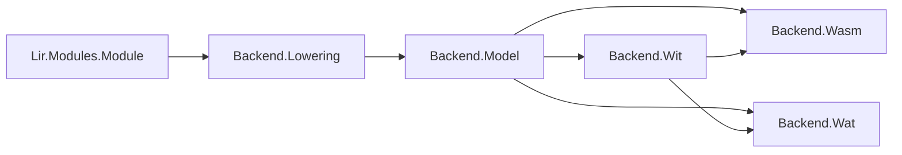

# Compiler backends: LIR → WASM / WAT / WIT

#13 — [Compiler backends: LIR → WASM component, WAT, and companion WIT](https://github.com/sanelli/lovelace/issues/13)

Branch: `feature/13-compiler-wasm-wat-backends` (linked to #13; created from `main` via `gh issue develop`).

Plan file: [`.cursor/plans/13-compiler-wasm-wat-backends.plan.md`](13-compiler-wasm-wat-backends.plan.md).

Depends on landed LIR ([#7](https://github.com/sanelli/lovelace/issues/7)) and IR Generator ([#11](https://github.com/sanelli/lovelace/issues/11)). No new Alire crates; all work stays in [`compiler/`](../../compiler/) (`lovelace_compiler`).

## Locked decisions

- **Artifact target:** WebAssembly **component** ([Binary.md](https://github.com/WebAssembly/component-model/blob/main/design/mvp/Binary.md)): magic `\0asm`, version `0x0d 0x00`, layer `0x01 0x00`. Not a bare core module as the default `.wasm`.
- **Mapping:** one LIR module → one component; each LIR subroutine → one core function (same UTF-8 name).
- **WASI entry (Option 1):** if any subroutine has `Entrypoint_Flag`, emit a synthetic core function named **`_start`** that calls that entrypoint, then returns Canonical-ABI success for `result` (`i32.const 0`). **Canon-lift** `_start` and **component-export** it as **`run`** with component type `func() -> result` (same signature as [`wasi:cli/run`](https://github.com/WebAssembly/WASI/blob/main/wasip2/cli/run.wit)). Do **not** emit the full `command` world import graph in this slice.
- **Exports:** every LIR subroutine with `Export_Flag` is canon-lifted and component-exported under its LIR name.
- **Two backends sharing one lowering + one WIT printer:**
  1. **WASM backend** → primary `.wasm` bytes + companion `.wit` text
  2. **WAT backend** → primary `.wat` text + companion `.wit` text (same WIT as the binary path for the same LIR input)
- **Out of scope this slice:** full WASI imports, browser/core-module-only format, `cabi_realloc`/memory (not needed for empty Unit ABI), Alexandria doc embedding, CLI `lovelace build`, analysis/opts, linking LIR `Dependencies`, statement-rich instruction sets beyond `No_Operation`.

## Architecture



| Package | Role |
| --- | --- |
| [`Lovelace.Compiler.Backend`](../../compiler/src/) | Crate namespace root for backends; shared error types |
| `Lovelace.Compiler.Backend.Model` | In-memory component sketch after lowering (core funcs, lifts, exports) |
| `Lovelace.Compiler.Backend.Lowering` | `Lower (LIR Module) → Model` or failure |
| `Lovelace.Compiler.Backend.Wit` | `To_Wit (Model) → UTF-8 WIT string` |
| `Lovelace.Compiler.Backend.Leb128` | Unsigned/signed LEB128 append helpers (host-only; no third-party crates) |
| `Lovelace.Compiler.Backend.Wasm` | Encode Model → component binary; pair with WIT |
| `Lovelace.Compiler.Backend.Wat` | Print Model → component WAT text; pair with WIT |

Public entry points (same-shape `Result` records, handle both arms):

```ada
function Emit_Wasm (The_Module : Modules.Module) return Wasm_Emit_Result;
-- Ok: Wasm_Bytes + Wit_Text

function Emit_Wat (The_Module : Modules.Module) return Wat_Emit_Result;
-- Ok: Wat_Text + Wit_Text
```

Callers validate via `Modules.Validate` inside Lowering (failure → `Invalid_Module`). Do not call Tokenize/Parse/Ir_Generator from backends.

## Lowering rules (this slice)

### Types

| LIR | Core WASM | Component (WIT / canon) |
| --- | --- | --- |
| `Unit` return, no params | `[] -> []` | `func()` |
| Entrypoint wrapper `_start` | `[] -> [i32]` | `func() -> result` (empty ok/err) |
| `I8`/`U8`/`I16`/`U16`/`I32`/`U32` | — | **reject** this slice |
| `I64`/`U64`/`F32`/`F64`/`I128`/`U128`/`F16` | — | **reject** this slice |

Rejection is `Unsupported_Type` with a clear detail string (frontend today only emits `Unit`; hand-built LIR tests may hit this). Document the future mapping table in [`docs/codegen.md`](../../docs/codegen.md).

### Instructions

- Empty body → empty core func body + `end`.
- `No_Operation` → emit nothing (skip).
- Exhaustive `case` on `Opcodes.Opcode`; unknown future opcodes → `Internal_Error`.

### Entrypoint / `_start` / `run`

1. At most one entrypoint (already enforced by LIR `Validate`).
2. Entrypoint signature must be Unit/no-params; else `Unsupported_Type` / `Internal_Error` as appropriate.
3. Append core func `_start`:
   - `call <entrypoint_func_index>`
   - `i32.const 0`  -- Canonical ABI: 0 = `ok`, 1 = `err` for empty `result`
   - `end`
4. Core-export `_start` (name `"_start"`) for clarity in dumps; component path uses canon lift of that core func.
5. Component type for lifted func: `func() -> result` (no payload types).
6. Component export name: `"run"` (export-only Option 1; document that a future slice may nest under `wasi:cli/run@…` instance naming for stricter Wasmtime world matching).

### Exported LIR methods

For each `Has_Export`:

- Canon lift the core func (empty opts; no memory).
- Component type `func()` when Unit/no-params.
- Component export name = LIR subroutine name (UTF-8).
- If the same subroutine is also the entrypoint, it still gets a normal export **and** `_start`/`run` is separate.

### Modules without entrypoint

- No `_start`, no `run` export.
- Only `Export_Flag` subroutines appear as component exports.
- A module with neither entrypoint nor any export still emits a valid empty-ish component (core module with all funcs unexported at component layer) — useful for tests; document this.

### Dependencies

Ignore LIR `Dependencies` (no component imports). Do not fail solely because depends are present.

## Binary encoding (`Backend.Wasm`)

Normative: component [Binary.md](https://github.com/WebAssembly/component-model/blob/main/design/mvp/Binary.md) + core [binary modules](https://webassembly.github.io/spec/core/binary/modules.html).

Emit roughly:

1. Nested **core module** (section id 1): type, function, export (`_start` and any names needed for aliasing), code. Use LEB128. Core magic/version inside the nested module.
2. **core instance** (section 2): instantiate that module with no args.
3. **alias** (section 6): alias core exports to component core-func indices as needed.
4. **type** (section 7): component func types (`func()`, `func() -> result`).
5. **canon** (section 8): `canon lift` for `_start` (if any) and each exported LIR func.
6. **export** (section 11): `"run"` and each exported LIR name.

Keep section ordering valid for incremental index spaces. Prefer a small, readable encoder over a general-purpose WASM toolkit (no new dependencies).

Bytes type: a dedicated `Byte_Sequence` (vector of `Interfaces.Unsigned_8`) on the success payload — not Ada `String` for binary.

## Text encoding (`Backend.Wat`)

Emit a component WAT that mirrors the same Model:

```wat
(component
  (core module
    (func $Hello ...)
    (func $_start (result i32)
      call $Hello
      i32.const 0)
    (export "_start" (func $_start))
    ...)
  (core instance ...)
  (alias ...)
  (type ...)
  (canon lift ...)
  (export "run" ...)
  (export "Other" ...))
```

Use stable formatting (fixed indent, deterministic order: LIR subroutine order, then `_start` last among core funcs) so AUnit goldens stay stable.

## Companion WIT (`Backend.Wit`)

Shared printer used by both backends. Example shape for a module named `Hello` with entrypoint + an extra export `Helper`:

```wit
package love:hello@0.1.0;

world module {
  export run: func() -> result;
  export Helper: func();
}
```

Rules:

- Package name: `love:<lowercase-sanitized-module-name>@0.1.0` (document sanitization: ASCII letters/digits keep case-folded; other UTF-8 → `-` or keep as WIT allows; stay deterministic).
- `export run: func() -> result;` **only** when an entrypoint exists.
- One `export <Name>: func();` per `Export_Flag` subroutine (omit the entrypoint name here if it is not also `Export_Flag`; if both flags, include both `run` and the named export).
- No `import` lines (Option 1).
- Same WIT string for `Emit_Wasm` and `Emit_Wat` given the same LIR module.

## Errors

```ada
type Backend_Error_Code is (Internal_Error, Unsupported_Type, Invalid_Module);
```

- `Internal_Error` **first** (result-and-internal-errors rule).
- `Invalid_Module` — `Validate` failed.
- `Unsupported_Type` — non-Unit signature in this slice.
- Record carries `Code` + UTF-8 `Detail`. Report to users later as generic internal / clear detail; no file diagnostics in this slice (backends take LIR, not source).

## Tests (AUnit in [`compiler/tests`](../../compiler/tests))

New fixture package `Lovelace.Compiler.Tests.Backend` (or split Wasm/Wat if large). Hand-build LIR via existing LIR builders (same style as IR Generator tests). Extend [`Support`](../../compiler/tests/src/lovelace-compiler-tests-support.ads) only if shared helpers help.

Minimum cases:

1. **Export-only Unit subroutine** — WASM magic/layer; WIT has named export, no `run`; WAT contains `(export "Name"`.
2. **Entrypoint** — core/`_start` present; component export `"run"`; WIT has `run: func() -> result`; WAT shows `$_start` and `i32.const 0`.
3. **Entrypoint + Export_Flag on same sub** — both `run` and named export.
4. **Two exports, no entrypoint** — two WIT/WAT/WASM exports; no `_start`/`run`.
5. **noop body** — still valid empty-ish code section.
6. **Unsupported type** (hand-built `I32` return) → `Unsupported_Type`.
7. **Wasm vs Wat WIT equality** — `Emit_Wasm (...).Wit_Text = Emit_Wat (...).Wit_Text` for the same module.
8. **Invalid empty module name** / Validate failure → `Invalid_Module`.

Do **not** add Wasmtime or `wasm-tools` as dependencies. Optional later: external smoke with Wasmtime outside CI. Goldens are string/byte assertions in Ada.

Register tests in [`lovelace-compiler-tests-suite.adb`](../../compiler/tests/src/lovelace-compiler-tests-suite.adb).

## Docs

- New [`docs/codegen.md`](../../docs/codegen.md): pipeline position, Option 1 entry/`_start`/`run`, type mapping (supported vs deferred), both backends, WIT companion rules, package map.
- Update [`docs/ir-generator.md`](../../docs/ir-generator.md) “Out of scope” / pipeline to point at codegen.
- Update [`docs/lir.md`](../../docs/lir.md) one-liner that backend lives in compiler.
- Update [`README.md`](../../README.md) Status if it lists compiler slices.
- GNATdoc leading comments on every new spec entity.

## Implementation order (after envelope 1–3)

Build **Model + Lowering + Wit** first; then **Wat** (easier to eyeball); then **Wasm** binary; then cross-check WIT equality tests.

## Execution envelope

1. Create GitHub issue (`gh issue create`) for compiler WASM/WAT/WIT backends; reuse if an equivalent open issue exists; record `#13`.
2. Sync `main`, then `gh issue develop 13 --name feature/13-compiler-wasm-wat-backends --checkout --base main`. Verify with `gh issue develop --list 13`.
3. Save this plan as `.cursor/plans/13-compiler-wasm-wat-backends.plan.md` with `#13` in the body.
4. Add Backend package skeleton + `Backend_Error` / emit result types; gnatformat.
5. Implement `Backend.Model` + `Backend.Lowering` (Validate, Unit-only check, `_start` synthesis, export set).
6. Implement `Backend.Wit` companion printer; AUnit golden fragments.
7. Implement `Backend.Wat` text emitter + tests.
8. Implement `Backend.Leb128` + `Backend.Wasm` binary emitter + tests (magic/layer, structural export presence).
9. Cross-backend WIT equality tests; suite registration; gnatformat all touched Ada.
10. Write/update docs (`codegen.md`, cross-links, README status).
11. Run all existing tests (`common/tests`, `lir/tests`, `compiler/tests`, root `alr build` as applicable).
12. Push (proxy env cleared) and open PR with `gh pr create`.
