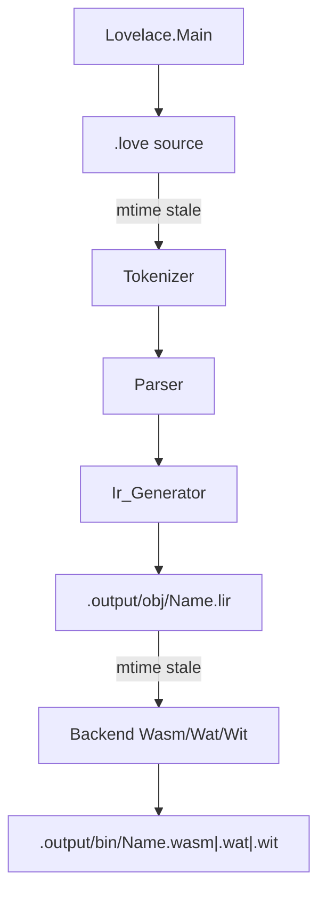

<!-- d033f602-a549-473d-aee8-aae041ce63cc -->
---
todos:
  - id: "1"
    content: "1. Create GitHub issue with gh issue create (CLI build, LV diagnostics, samples, integration tests); reuse if equivalent open; record 15."
    status: completed
  - id: "2"
    content: "2. Sync main, then gh issue develop 15 --name feature/15-cli-build-command --checkout --base main; verify with gh issue develop --list 15."
    status: completed
  - id: "3"
    content: "3. Rename CreatePlan file to .cursor/plans/15-cli-build-command.plan.md with #15 in the body (do not rewrite a second copy)."
    status: completed
  - id: "4"
    content: "4. Add samples/ barebone empty-body .love for build; document samples-per-feature policy in docs."
    status: pending
  - id: "5"
    content: "5. Add Lovelace.Compiler.Error_Codes (LV#####) and Diagnostics printer; AUnit format tests."
    status: pending
  - id: "6"
    content: "6. Map tokenizer/parser/IR/backend failures to LV codes; add program-identifier vs .love basename check (LV00009)."
    status: pending
  - id: "7"
    content: "7. Rename procedure Lovelace to Lovelace.Main; depend on lovelace_compiler; implement globals, logo, help, version."
    status: pending
  - id: "8"
    content: "8. Implement lovelace build (flags, .output/obj|bin, incremental mtimes, info lines, emit wasm/wat/wit)."
    status: pending
  - id: "9"
    content: "9. Write docs/cli.md and docs/diagnostics.md; update README/codegen for CLI wiring (no LIR format version changes)."
    status: pending
  - id: "10"
    content: "10. Add lovelace/tests (lovelace_tests) for arguments/helpers used by the CLI."
    status: pending
  - id: "11"
    content: "11. Add lovelace/integration_tests (lovelace_integration_tests): inconclusive without wasmtime; else build sample + run wasm and wat."
    status: pending
  - id: "12"
    content: "12. gnatformat touched Ada; alr build; run common/lir/compiler/lovelace unit tests (integration optional/recorded)."
    status: pending
  - id: "13"
    content: "13. Push (proxy cleared) and open PR with gh pr create."
    status: pending
isProject: false
---
# CLI build command and diagnostics

#15 — [CLI build command, LV diagnostics, samples, and integration tests](https://github.com/sanelli/lovelace/issues/15)

Branch: `feature/15-cli-build-command` (linked; created from `main` via `gh issue develop`).

Plan file: [`.cursor/plans/15-cli-build-command.plan.md`](15-cli-build-command.plan.md).

## Standing rules for this work

### Version discipline (mandatory)

Do **not** change any version unless the user explicitly asks in the request for that change. That includes:

- LIR binary / text format `Format_Major` / `Format_Minor` (stay on **1.0**)
- Alire crate `version` fields in `alire.toml`
- Other artifact or schema version numbers

In particular: **do not bump LIR to 1.1** and do **not** change the `.lir` / `.tlir` layout to persist origins. In-memory origins stay as they are today; codecs continue to drop them on encode/decode (existing behavior). Diagnostics that need filepath/row/column use the live `.love` source and frontend spans during the frontend path.

The `version` **command** still prints the product string `0.0.1-alpha.1 @ {hash}` as specified for this feature; that is CLI output text, not a format/crate version bump.

### Samples policy (every new feature)

For **every** new user-facing feature, add at least one `.love` file under [`samples/`](samples/) that exercises that feature.

- Subfolders under `samples/` are allowed when grouping is needed (e.g. multi-file projects or solutions later).
- For **this** CLI build slice: one barebone program with **no instructions** in the body, e.g. `samples/Hello.love`:

```text
program Hello; begin end.
```

Integration tests must build that sample (path under `samples/`), not an ad-hoc-only fixture that never lands in the tree.

---

## Current baseline

- CLI is a no-op [`lovelace/src/lovelace.adb`](lovelace/src/lovelace.adb) with **no** `depends-on` on `lovelace_compiler` ([`lovelace/alire.toml`](lovelace/alire.toml)).
- Pipeline APIs already exist: `Tokenizer.Tokenize`, `Parser.Parse`, `Ir_Generator.Generate`, `Backend.Wasm.Emit_Wasm`, `Backend.Wat.Emit_Wat`, `Lir.Binary.Read` / `Write`.
- LIR origins exist **in memory** only; [`.lir` / `.tlir` v1.0 drop them](docs/lir.md) — **unchanged** in this plan.
- Frontend errors use local enums (`Tokenizer_Error_Code`, …), not `LV#####` user codes.
- Naming rule: rename root `procedure Lovelace` → **`Lovelace.Main`** before the CLI depends on `lovelace_common` (via `lovelace_compiler`). Further CLI units are **children of `Lovelace.Main`** only (no other top-level `Lovelace.*` packages in the CLI crate).
- `samples/` may be empty today; this work creates the first barebone sample.



## Concrete decisions (locked)

| Topic | Choice |
| --- | --- |
| Global args | Only before the command: `--no-logo`, `--no-colour` |
| British spelling | Flag is `--no-colour` (not `--no-color`) |
| Default artifacts | `.wasm` + `.wit` under output `bin/` |
| `--output-format` | `wasm` (default), `wat`, `wasm,wat`, `wat,wasm` (comma set; both mean wasm+wat) |
| `--no-wit` | Do not write `.wit` (still may compute WIT internally when emitting) |
| Output root | Default `.output` in **cwd**; `--output-folder PATH` replaces it (create if missing) |
| Layout | `{root}/obj/{Program}.lir`, `{root}/bin/{Program}.{wasm\|wat\|wit}` |
| Program vs file | Basename of the `.love` path without extension must **exactly** equal the `program` identifier (case-sensitive). Else diagnostic on the identifier span |
| Future no-arg build | Document only; reject missing `.love` for now with a clear error (no `.pjlove` / `.slnlove` yet — note correct extension is `.pjlove`, not `.prjlove`) |
| Logo | Fixed UTF-8 ASCII banner printed to stdout unless `--no-logo` |
| Version string | `0.0.1-alpha.1 @ {short_git_hash}` (build-time hash; `nogit` if unavailable) |
| Colours | ANSI green for `[info]`, red for `[err]` and the `[LVxxxxx]` line; disabled by `--no-colour` |
| Errors | stderr only; info on stdout |
| LIR format | **No change** — remain v1.0; origins not persisted |
| Sample for this feature | `samples/Hello.love` (or equivalent name) — barebone empty body |
| Integration tests | Separate crate `lovelace/integration_tests` (`lovelace_integration_tests`); **not** part of the usual `alr -C */tests run` checklist |
| Wasmtime | `wasmtime run -W component-model=y` plus `--invoke` if required for export `run`; inconclusive if `wasmtime` not on `PATH` |

---

## 1. Create GitHub issue

Done: [#15](https://github.com/sanelli/lovelace/issues/15).

## 2. Linked feature branch from `main`

Done: `feature/15-cli-build-command` (verified with `gh issue develop --list 15`).

## 3. Rename plan file (do not rewrite)

Done: [`.cursor/plans/15-cli-build-command.plan.md`](15-cli-build-command.plan.md).

## 4. Samples: barebone program + policy note

- Create [`samples/Hello.love`](samples/Hello.love) (name must match `program` identifier):

```text
program Hello; begin end.
```

No statements inside `begin`/`end`.

- Document under `docs/` (e.g. short section in `docs/cli.md` or `docs/samples.md`): every new feature adds a `.love` under `samples/`; subfolders allowed for project/solution grouping later.
- Integration tests (step 11) compile this file via `lovelace build`.

## 5. Compiler: unified `LV#####` codes + diagnostic printer

Add in `lovelace_compiler`:

### `Lovelace.Compiler.Error_Codes`

- Stable public codes as an enumeration or constants with canonical text form `LV` + **5 zero-padded digits** (e.g. `LV00001`).
- **One numeric value per distinct error kind** across the compiler (tokenizer, parser, IR, backend, CLI/build semantic checks).
- Suggested initial allocation (extend as needed; document the table in `docs/diagnostics.md`):

| Code | Kind |
| --- | --- |
| `LV00001` | Internal_Error (any stage) |
| `LV00002` | Unrecognized_Symbol |
| `LV00003` | Invalid_Utf_8 |
| `LV00004` | Unexpected_End_Of_Input |
| `LV00005` | Unexpected_Token |
| `LV00006` | Unexpected_Trailing |
| `LV00007` | Unsupported_Type (backend) |
| `LV00008` | Invalid_Module (backend / LIR validate surfaced to user) |
| `LV00009` | Program_Name_Filename_Mismatch |
| `LV00010` | Source_File_Not_Found / IO |
| `LV00011` | Invalid_Command_Line (unknown flag, bad `--output-format`, missing `.love`) |

Keep existing internal enums; map them to `LV#####` at report time (do not break AUnit assertions that check internal enums — add mapping helpers).

### `Lovelace.Compiler.Diagnostics`

- Input: filename, span (row/column from `Source_Position`), source text, `LV` code, description.
- Render **exactly** (stderr):

```text
[err] filename:{row},{column}
{LINE CONTAINING THE ERROR FROM THE SOURCE .love FILE}
{caret line(s) pointing at the column}
[LVxxxxx] {Description of the error}
```

- Caret: spaces/UTF-8-width-safe padding to `Column`, then `^` (and `~~~` under multi-column spans when `Last /= First`).
- Extract the source line using `Line` / `Byte_Index` from the UTF-8 source buffer.
- No colour here — CLI wraps with red when colour enabled.
- Multiple errors: print each block in order; non-zero exit if any error.

Add AUnit coverage in `compiler/tests` for formatting (known source snippet → exact stderr-shaped string).

## 6. Semantic check: program identifier vs filename

After successful `Parse` (or on AST):

- Let `Base` = filename stem of the input path (strip directory; strip final `.love` only).
- Let `Name` = `Ast.Name (Module)`.
- If `Base /= Name`, emit `LV00009` at `Ast.Name_Span`, description naming both strings.
- Applies even when later stages would succeed.

## 7. CLI skeleton: Main, globals, help, version, logo

### Alire / naming

- [`lovelace/alire.toml`](lovelace/alire.toml): `[[depends-on]] lovelace_compiler = "*"` + pin `{ path = "../compiler" }`. Do **not** change the crate `version` field unless the user asks.
- Replace [`lovelace/src/lovelace.adb`](lovelace/src/lovelace.adb) with `lovelace-main.adb` / `procedure Lovelace.Main`; update [`lovelace.gpr`](lovelace/lovelace.gpr) `for Main`.
- Child packages only under `Lovelace.Main.*`, e.g.:
  - `Lovelace.Main.Terminal` — colour-aware `Put_Info`, `Put_Error_Block`, logo
  - `Lovelace.Main.Arguments` — split global opts / command / command opts
  - `Lovelace.Main.Help`
  - `Lovelace.Main.Version`
  - `Lovelace.Main.Build`

### Argument grammar

```text
lovelace [global-options...] <command> [command-parameters...]
```

- Globals (before command only): `--no-logo`, `--no-colour`. Unknown global → `LV00011`.
- If `--no-logo` appears after the command → error (must be before command).
- Commands: `build`, `help`, `version`. Unknown command → error + suggest `help`.

### Logo

- Print banner to stdout at startup unless `--no-logo`.
- Banner is a small fixed UTF-8 ASCII art + `Lovelace` wordmark (invent once; keep stable for tests with `--no-logo`).

### `version`

- Print `0.0.1-alpha.1 @ <hash>` then exit 0.
- Embed hash via Alire `[[actions]]` pre-build writing a tiny generated Ada spec (e.g. `lovelace/src/generated/lovelace-main-git_hash.ads`) from `git rev-parse --short HEAD`, or `nogit` when `.git` missing.

### `help` / `help build`

- No command: summarize globals + commands.
- `lovelace help build`: document `.love` operand, `--no-wit`, `--output-format`, `--output-folder`, incremental behavior, output layout, examples from the request.
- `lovelace help help` / `help version` briefly.

## 8. Implement `lovelace build`

### Command parameters

| Param | Meaning |
| --- | --- |
| first positional | required `.love` path (this slice) |
| `--no-wit` | skip writing `.wit` |
| `--output-format <value>` | see table above |
| `--output-folder <path>` | replace `.output` |

Unknown build flags → `LV00011`. Flags may appear in any order after `build` (examples in the request).

### Steps with `[info]` lines (green `[info]` prefix)

Emit one stdout line per performed step, for example:

- `[info] Reading source …`
- `[info] Tokenizing …` / `Parsing …` / `Generating LIR …` / `Writing …/obj/X.lir`
- `[info] LIR up to date, skipping frontend`
- `[info] Emitting WASM …` / `WAT …` / `WIT …`
- `[info] Artifacts up to date, skipping backend`
- `[info] Build succeeded`

Skip lines for stages not run due to incremental hits; still allowed to log the skip.

### Incremental rules

Using `Ada.Directories.Modification_Time` (or equivalent):

1. Ensure output root, `obj/`, `bin/` exist (`Create_Path`).
2. **LIR:** If `obj/{Name}.lir` exists and `mtime(lir) >= mtime(love)`, do **not** re-tokenize/parse/generate; `Binary.Read` when backend needs it. Else run frontend → `Binary.Write` (**v1.0** codec, origins not stored on disk).
3. **Note:** program-name check runs only on frontend path; when skipping frontend, trust prior successful build (name already matched when lir was written). Optionally verify `Modules.Name = stem` after read (cheap consistency check).
4. **Each requested artifact** independently: if file missing **or** `mtime(artifact) < mtime(lir)`, regenerate from LIR; else skip.
5. WIT is one file: regenerate if requested and (missing or older than lir). When both wasm and wat refresh, write WIT once.

### Frontend path

1. Read UTF-8 file (IO failure → diagnostic).
2. `Tokenize (Source, Filename)` → on failure print all tokenizer diagnostics via Diagnostics + Terminal (red).
3. `Parse` → same.
4. Program/filename check → `LV00009`.
5. `Ir_Generator.Generate` → map failure to `LV00001`.
6. `Lir.Binary.Write` to `obj/{Name}.lir` (existing **1.0** format).

### Backend path

- Resolve `Name` from LIR module name after read/generate.
- `wasm` in format set → `Emit_Wasm`; write `.wasm` bytes; keep `Wit_Text` if wit requested.
- `wat` in format set → `Emit_Wat`; write `.wat`; same WIT string expected.
- Wit only / wit with emit: write `.wit` unless `--no-wit`.
- Backend errors → map to `LV00007` / `LV00008` / `LV00001`; if no source span, print `[err]` with file `Name.love` or lir path and column 1, or a reduced form still using the required shape where possible.

### Exit codes

- `0` on success; non-zero on any error (after printing).

## 9. Documentation

New [`docs/cli.md`](docs/cli.md): invocation grammar, globals, `build` / `help` / `version`, colours, logo, output layout, incremental rules, examples, pointer to `samples/Hello.love`.

New [`docs/diagnostics.md`](docs/diagnostics.md): `LV#####` table + exact render format (align with [`.cursor/rules/diagnostics.mdc`](.cursor/rules/diagnostics.mdc) but use `LV` prefix as specified).

Samples policy: short note in `docs/cli.md` or dedicated [`docs/samples.md`](docs/samples.md).

Update [`README.md`](README.md) “not yet a usable compiler” → point at `lovelace build`, samples, and docs.

Update codegen/IR docs for CLI wiring only. **Do not** rewrite LIR format docs as if origins were persisted.

Register nothing new in gnatdoc Projects unless a new host **library** crate appears (CLI is an application; skip unless script already lists it).

## 10. Nested unit tests for CLI helpers

Add [`lovelace/tests`](lovelace/tests) crate `lovelace_tests` (AUnit, pin `..`, depends on `lovelace` or test against packages — prefer testing `Lovelace.Main.Arguments` / format helpers without spawning if possible).

Cover: global vs command flag placement; `--output-format` parsing; help text contains `build`; version string prefix; mismatch detection helper.

Keep these in the **normal** test checklist.

## 11. Integration tests (opt-in)

New crate [`lovelace/integration_tests`](lovelace/integration_tests) / `lovelace_integration_tests`:

- AUnit driver **not** required by workspace default docs checklist; document:

  `alr -C lovelace/integration_tests run`

- Fixture: repo [`samples/Hello.love`](samples/Hello.love) (step 4), built with a dedicated `--output-folder` under a temp dir so the tree stays clean.
- Locate built `lovelace` executable (Alire `../bin/lovelace` or `PATH`).
- If `GNAT.OS_Lib.Locate_Exec_On_Path ("wasmtime")` is null → **`Assert_Inconclusive`** (or AUnit inconclusive mechanism) with message `wasmtime not found`.
- Else:
  1. `lovelace --no-logo build <repo>/samples/Hello.love --output-format wasm,wat --output-folder <temp>` (wit on).
  2. Assert `obj/Hello.lir`, `bin/Hello.wasm`, `bin/Hello.wat`, `bin/Hello.wit` exist under that folder.
  3. Run wasmtime on **both** `.wasm` and `.wat` with component-model enabled (and `--invoke` if needed for `run`).
  4. Success iff both exit 0; else fail with captured stderr.

Do **not** add Wasmtime as an Alire dependency (CLI subprocess only).

## 12. Format, build, run normal tests

- `alr exec -- gnatformat -w 120 -P …` on every touched Ada file.
- `alr build` at repo root.
- Run: `alr -C common/tests run`, `alr -C lir/tests run`, `alr -C compiler/tests run`, `alr -C lovelace/tests run`.
- Record that integration tests are separate; optionally run them if wasmtime is present and note result in the PR body.

## 13. Push and open PR

Proxy-cleared `git push -u origin HEAD`, then `gh pr create` summarizing CLI surface, diagnostics, samples, and test plan (unit + optional integration). State clearly that LIR format remains 1.0.

Commits: subject starts with `#15` (plain `git commit -m`, no heredocs per agent-shell).

---

## Key files to add/change

| Area | Files |
| --- | --- |
| Samples | [`samples/Hello.love`](samples/Hello.love); optional `docs/samples.md` |
| Diagnostics | new `compiler/src/lovelace-compiler-error_codes.ads`, `…-diagnostics.ads/.adb`, compiler tests |
| CLI | `lovelace-main.adb`, `Lovelace.Main.*` children, `alire.toml` depends-on (no version field bump), gpr Main |
| Integration | `lovelace/integration_tests/**` |
| Docs | `docs/cli.md`, `docs/diagnostics.md`, README, codegen/IR CLI notes |
| LIR | **no format/version changes** |
