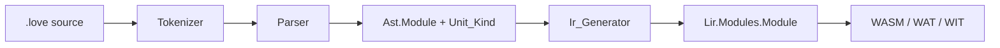

# Compiler support for Lovelace modules

#17 — [Compiler: Lovelace module compilation units](https://github.com/sanelli/lovelace/issues/17)

Branch: `feature/17-compiler-modules` (linked to #17; created from `main` via `gh issue develop`).

## Locked decisions

- **Grammar** (in addition to the existing program form):

```ebnf
compilation_unit     = program_unit | module_unit ;
program_unit         = program_header , "begin" , "end" , "." ;
program_header       = "program" , identifier , ";" ;
module_unit          = module_header , "end" , "." ;
module_header        = "module" , qualified_identifier , ";" ;
qualified_identifier = identifier , { "." , identifier } ;
```

- **No `begin` in modules** — exactly `module Name; end.` (user-specified).
- **Qualified name** is stored as one UTF-8 string with ASCII `.` separators (e.g. `"Foo.Bar"`). `Name_Span` covers the first identifier through the last (including dots).
- **AST shape for modules:** `Unit_Kind = Module_Unit`, **zero subroutines** (no synthetic entrypoint/export). Programs stay `Program_Unit` with one entrypoint+export subroutine named like today.
- **1:1 mapping:** frontend AST module name → LIR module name → WASM/WAT/WIT artifacts (`obj/<Name>.lir`, `bin/<Name>.wasm`, …). Dots in the name become part of those filenames (`Foo.Bar.love` → `Foo.Bar.wasm`). WIT package sanitization already maps `.` → `-` (`love:foo-bar@0.1.0`).
- **Filename rule:** `Ast.Name` must equal `Love_Basename(path)` (already strips directories and a final `.love`). Reuse [`LV00009`](compiler/src/lovelace-compiler-error-codes.ads); broaden the user text to “compilation unit” / “program|module” via `Unit_Kind`. Do **not** extend programs to dotted names in this slice.
- **IR Generator / backend:** no special module path — empty subroutine lists already lower and emit (LIR allows zero subroutines; lowering skips `_start` when there is no entrypoint).



## Envelope (agent workflow)

1. Create GitHub issue with `gh issue create` (title/body for compiler module units); record `#17`.
2. Sync `main`, then `gh issue develop 17 --name feature/17-compiler-modules --checkout --base main`. Verify with `gh issue develop --list 17`.
3. Save this plan as [`.cursor/plans/17-compiler-modules.plan.md`](.cursor/plans/) with `#17` in the body.
4. Tokenizer: add `Module_Keyword` / lexeme `module`.
5. AST: add `Unit_Kind`; allow empty modules.
6. Parser: recursive-descent module form + qualified names; dispatch on first keyword.
7. Reporting / CLI: filename check messaging for both unit kinds.
8. AUnit tests + samples.
9. Docs updates.
10. Run all existing nested AUnit crates / workspace tests.
11. Push (proxy cleared) and open a PR with `gh pr create`.

## Implementation

### 4. Tokenizer — [`compiler/src/lovelace-compiler-tokens.ads`](compiler/src/lovelace-compiler-tokens.ads), [`tokenizer.adb`](compiler/src/lovelace-compiler-tokenizer.adb)

- Add `Module_Keyword` to `Keyword_Subtype` and the keyword table (`"module"`).
- Extend `Describe_Token` cases in the parser.
- Tests: `module` keyword; reservation (`modulex` / `modules` stay identifiers); include `module` in the keyword-case matrix.

### 5. AST — [`compiler/src/lovelace-compiler-ast.ads`](compiler/src/lovelace-compiler-ast.ads) / `.adb`

- Add `type Unit_Kind is (Program_Unit, Module_Unit)` with GNATdoc `@enum`.
- Store `Kind` on `Module`; expose `Kind (The_Module)`.
- Change construction so modules can be empty:
  - Prefer `Create_Module (Name, Name_Span, Filename, Span, Kind, Subroutines)` taking a `Subroutine_Sequence` (program path builds a one-element sequence; module path passes `Empty_Subroutine_Sequence`).
  - Update the existing one-subroutine helper call sites in parser/tests, or keep a thin overload that appends one subroutine for programs.

### 6. Parser — [`compiler/src/lovelace-compiler-parser.adb`](compiler/src/lovelace-compiler-parser.adb)

Recursive descent (existing cursor helpers):

- `Parse_Compilation_Unit`: peek keyword → `Parse_Program_Unit` or `Parse_Module_Unit`, else `Unexpected_Token` (“expected keyword "program" or "module"”).
- `Parse_Qualified_Identifier`: first `Expect_Identifier`, then while next is `Full_Stop` followed by identifier, consume `.` + identifier; build name string and combined span. Trailing `.` or `..` → `Unexpected_Token` / `Unexpected_End_Of_Input`.
- `Parse_Module_Header` / `Parse_Module_Unit`: `module` + qualified name + `;` + `end` + `.` (**no** `begin`).
- Success for modules: `Kind => Module_Unit`, empty subroutines, origins from name/unit spans.
- Programs unchanged (still require `begin` / single identifier / synthetic entrypoint subroutine), but set `Kind => Program_Unit`.

### 7. Reporting and CLI

- Rename [`Program_Name_Matches_File`](compiler/src/lovelace-compiler-reporting.ads) → `Unit_Name_Matches_File` (same comparison: `Ast.Name = Love_Basename`). Update [`lovelace-main-build.adb`](lovelace/src/lovelace-main-build.adb) and tests.
- LV00009 description: mismatch message uses `program` or `module` from `Ast.Kind`.
- Help / CLI copy in [`lovelace-main-help.adb`](lovelace/src/lovelace-main-help.adb): mention both unit forms and the basename rule (including dots).

### 8. Tests and samples

**Compiler AUnit** ([`compiler/tests`](compiler/tests)):

- Tokenizer: `module` keyword + reservation.
- Parser: canonical `module Empty; end.`; dotted `module Foo.Bar; end.`; whitespace variants; reject `module Foo; begin end.` (unexpected `begin`); reject trailing `.` in name; reject `Module` (identifier); empty-subroutine assertions + `Kind`.
- IR generator: empty module lowers to LIR with matching name/origins and `Subroutine_Count = 0`; dotted name preserved.
- Diagnostics: `Unit_Name_Matches_File` for `Foo.Bar` / `Foo.Bar.love`; mismatch still LV00009.

**Samples** (update [`docs/samples.md`](docs/samples.md)):

- [`samples/Empty.love`](samples/Empty.love) — `module Empty; end.`
- [`samples/Foo.Bar.love`](samples/Foo.Bar.love) — `module Foo.Bar; end.`

**CLI / integration:**

- Unit or integration coverage that `lovelace build samples/Empty.love` (and optionally `Foo.Bar.love`) writes artifacts; **do not** require `wasmtime run` (no entrypoint). Keep Hello program + wasmtime path as-is.

### 9. Docs

- Expand [`docs/program-grammar.md`](docs/program-grammar.md) (or rename to `compilation-unit-grammar.md` and fix links) with both forms and qualified-identifier production.
- Update [`docs/parser.md`](docs/parser.md), [`docs/tokenizer.md`](docs/tokenizer.md), [`docs/token-grammar.md`](docs/token-grammar.md), [`docs/cli.md`](docs/cli.md), [`docs/diagnostics.md`](docs/diagnostics.md), [`docs/ir-generator.md`](docs/ir-generator.md), [`docs/samples.md`](docs/samples.md).

## Out of scope

- Module bodies (declarations, imports, subroutines inside modules)
- Dotted names on `program`
- Directory-as-namespace (`Foo/Bar.love`)
- New Alire crates or LIR format version bumps
