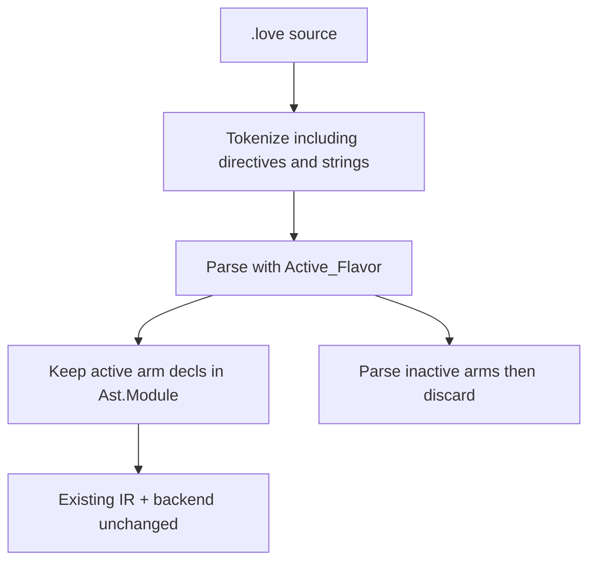

# Flavor `#if` directives (roadmap macro step 1)

#21 — [Compiler: flavor #if directives (roadmap macro step 1)](https://github.com/sanelli/lovelace/issues/21)

Branch: `feature/21-flavor-if-directives` (linked to #21; created from `main` via `gh issue develop`).

Plan file: [`.cursor/plans/21-flavor-if-directives.plan.md`](21-flavor-if-directives.plan.md).

Roadmap: [docs/roadmap/001-roadmap-print-integer-wasi.md](../../docs/roadmap/001-roadmap-print-integer-wasi.md) § Macro step 1.

Related rules: directives are real language syntax ([language-and-projects.mdc](../rules/language-and-projects.mdc)); they condition compilation and do not become LIR ([compiler-pipeline.mdc](../rules/compiler-pipeline.mdc)); recursive descent ([parser-recursive-descent.mdc](../rules/parser-recursive-descent.mdc)).

**How to execute:** run one numbered step per invocation (or explicitly ask for a consecutive range). Do not skip the envelope (1–3) or the closing tests/PR (14–15). After each Ada edit step, run `alr exec -- gnatformat` on touched files and build/run the relevant test crate before moving on.

## Locked decisions

- **End token:** `#end` (one directive token; not `#endif`, not `#end if`).
- **Condition form only:** `#if flavor = "wasi" | "native" | "web"` (same after `#elsif`). No general expressions, no `#pragma`, no platform/OS splits.
- **`flavor`:** ordinary identifier; parser requires exact lexeme `flavor` (not a new keyword).
- **Literals:** double-quoted `String_Literal` tokens; no escape sequences (`"[^"]*"`). Compare content case-sensitively to `wasi` / `native` / `web`.
- **Punctuation:** add `=` (`Equals`).
- **Directive tokens:** single tokens `#if`, `#elsif`, `#else`, `#end` as `Token_Kind` `Directive` + `Directive_Subtype` (keeps `#end` distinct from keyword `end`; does not disturb `16#FF#s32`).
- **Where allowed:** only in a **module** unit’s declaration list (alongside `procedure_declaration`). Not in `program` units; not inside procedure bodies.
- **Nesting:** allowed (`flavor_conditional` may contain nested `flavor_conditional`).
- **Selection:** parse **every** arm for syntax validity; append declarations to the AST **only** from the active arm (first matching `#if`/`#elsif`, else `#else`). Inactive arms never appear in the module used for lowering. Same procedure name in mutually exclusive arms is allowed; clash rules apply only among surviving declarations.
- **CLI:** `lovelace build --flavor wasi|native|web`; **default `wasi`**. No per-flavor output folders (roadmap step 11).
- **AST:** no persistent directive nodes; selection is parse-time only.
- **Out of scope:** Augusta, imports, WASI, export, statements, LIR/backend changes (except CLI passing flavor into Parse), general string expressions in the language.

Example (tests + sample):

```love
module FlavorSelect;
#if flavor = "wasi"
   procedure WasiOnly();
   begin
   end;
#elsif flavor = "native"
   procedure NativeOnly();
   begin
   end;
#else
   procedure WebOnly();
   begin
   end;
#end
end.
```



## Surface grammar (this slice)

```ebnf
module_unit           = module_header , { module_declaration } , "end" , "." ;
module_declaration    = procedure_declaration | flavor_conditional ;
flavor_conditional    = "#if" , flavor_condition , { module_declaration } ,
                        { "#elsif" , flavor_condition , { module_declaration } } ,
                        [ "#else" , { module_declaration } ] ,
                        "#end" ;
flavor_condition      = "flavor" , "=" , string_literal ;
```

`string_literal` content must be exactly `wasi`, `native`, or `web`; otherwise `Invalid_Flavor_Condition` (`LV00012`).

Tokenizer scan order (longest-match already in `Longest_Scan_Match`): float → integer → **directive** → **string** → identifier → punctuation (with `=`). Directive patterns are exact `#if` / `#elsif` / `#else` / `#end` so they never steal `#16#…`.

---

## Steps (execute in order)

### 1. Create GitHub issue

- Done: [#21](https://github.com/sanelli/lovelace/issues/21).

### 2. Linked feature branch from `main`

- Done: `feature/21-flavor-if-directives` linked via `gh issue develop --base main`.

### 3. Save plan into the repo

- Done: this file.

### 4. `Lovelace.Compiler.Flavor`

**Add**

- [`compiler/src/lovelace-compiler-flavor.ads`](../../compiler/src/lovelace-compiler-flavor.ads) (body only if needed).

**API (concrete)**

- `type Flavor is (Wasi, Native, Web);`
- `function Default return Flavor;` → `Wasi`
- `function Name (The_Flavor : Flavor) return String;` → `"wasi"` / `"native"` / `"web"`
- `function Try_Parse_Name (Text : String; The_Flavor : out Flavor) return Boolean;` — case-sensitive exact match

**Done when:** package compiles in `lovelace_compiler`, GNATdoc leading comments present, `gnatformat` applied.

### 5. Token model extensions

**Edit** [`compiler/src/lovelace-compiler-tokens.ads`](../../compiler/src/lovelace-compiler-tokens.ads) (and `.adb` if needed).

- `Token_Kind`: add `Directive`, `String_Literal`.
- `Directive_Subtype`: `If_Directive`, `Elsif_Directive`, `Else_Directive`, `End_Directive` (lexemes `#if`, `#elsif`, `#else`, `#end`).
- `Punctuation_Subtype`: add `Equals` (`=`).
- Extend `Token` variant: `Directive` carries `Directive_Value`; `String_Literal` like `Identifier` (lexeme via span).
- Update any `case Kind is` exhaustiveness in Tokens/Tokenizer helpers.

**Done when:** crate builds; no parser/CLI changes yet (may leave temporary dead kinds until step 6 registers them).

### 6. Tokenizer: directives, strings, `=`

**Edit** [`compiler/src/lovelace-compiler-tokenizer.ads`](../../compiler/src/lovelace-compiler-tokenizer.ads) / `.adb`.

- Register scan classes: directive pattern `#elsif|#else|#end|#if` (order so longer `#elsif` wins via longest-match), string pattern `"[^"]*"`, punctuation including `=`.
- Scan order: float → integer → directive → string → identifier → punctuation.
- Classify directive lexeme → `Directive_Subtype`; `=` → `Equals`.
- Unterminated `"`: new `Tokenizer_Error_Code` `Unterminated_String_Literal` (mapped in step 7); do not emit a partial string token.
- Regression: `16#FF#s32` remains one `Integer_Literal`; bare `#` / `#pragma` remain `Unrecognized_Symbol`.

**Tests** in [`compiler/tests/`](../../compiler/tests/) tokenizer fixture:

- Each of `#if` `#elsif` `#else` `#end`
- `"wasi"` → `String_Literal`; **Lexeme is the full matched text including `"`**; parser strips quotes when reading flavor name
- `=` punctuation
- based integer unchanged
- unterminated string fails
- `#pragma` / bare `#` fail

**Done when:** `alr -C compiler/tests run` passes for tokenizer cases; `gnatformat` applied.

### 7. Diagnostic codes and reporting

**Edit**

- [`compiler/src/lovelace-compiler-error_codes.ads`](../../compiler/src/lovelace-compiler-error_codes.ads) / `.adb`
- [`compiler/src/lovelace-compiler-reporting.ads`](../../compiler/src/lovelace-compiler-reporting.ads) / `.adb`
- [`docs/diagnostics.md`](../../docs/diagnostics.md)

**Codes**

- Parser `Invalid_Flavor_Condition` → **`LV00012`**
- Tokenizer `Unterminated_String_Literal` → **`LV00013`**

Wire `To_Error_Code` / `Label` for both. `Internal_Error` stays first on stage-local enums; append new literals after existing ones on those enums.

**Done when:** reporting maps compile; diagnostics table documents the two new codes.

### 8. Parser API + test helpers take `Active_Flavor`

**Edit**

- [`compiler/src/lovelace-compiler-parser.ads`](../../compiler/src/lovelace-compiler-parser.ads):  
  `function Parse (Source_Text : String; Token_List : Tokens.Token_Sequence; Active_Flavor : Flavor.Flavor) return Parse_Result;`
- [`compiler/tests/src/lovelace-compiler-tests-support.ads`](../../compiler/tests/src/lovelace-compiler-tests-support.ads) / `.adb`: `Must_Parse` / `Must_Fail_Parse` take optional/default `Active_Flavor => Flavor.Default` (or explicit parameter defaulting to `Wasi`).
- Fix every `Parser.Parse` call site (prefer updating CLI to pass `Flavor.Default` so the workspace still builds).
- Add `Parser_Error_Code.Invalid_Flavor_Condition` (used in step 9).

**Done when:** compiler + tests compile with the new signature; existing tests still pass with default `wasi` (no `#if` sources yet).

### 9. Parse `flavor_conditional` (selection)

**Edit** [`compiler/src/lovelace-compiler-parser.adb`](../../compiler/src/lovelace-compiler-parser.adb) (and spec helpers as needed).

- Replace module body loop `{ procedure_declaration }` with `{ module_declaration }`.
- `Parse_Module_Declaration`: if peek `#if` → `Parse_Flavor_Conditional`; else `Parse_Procedure_Declaration`.
- `Parse_Flavor_Condition`: expect identifier `flavor`, `=`, `String_Literal`; strip quotes; `Try_Parse_Name` or error `Invalid_Flavor_Condition`.
- `Parse_Flavor_Conditional (Keep_Declarations : Boolean)` logic:
  - Evaluate `#if` condition against `Active_Flavor`.
  - For each arm: recursively parse `{ module_declaration }` with `Keep := Keep_Declarations and Arm_Is_Selected`.
  - First true `#if`/`#elsif` wins; later `#elsif` arms are inactive even if their condition matches; `#else` active only if no prior arm matched.
  - Always consume through matching `#end` (nesting via recursive `Parse_Flavor_Conditional`).
  - When `Keep` is False, parse procedures into a throwaway unit / skip appending (syntax + nested structure still validated).
- Reject `#if` / `#elsif` / `#else` / `#end` in `program` units and inside procedure bodies (`Unexpected_Token` with clear detail).
- Name clash: only when appending to the real unit.

**Done when:** hand-checked or temporary driver shows wasi vs native selection; `gnatformat` applied.

### 10. AUnit parser / selection tests

**Edit** [`compiler/tests/src/lovelace-compiler-tests-parser.ads`](../../compiler/tests/src/lovelace-compiler-tests-parser.ads) / `.adb` (and suite registration).

Required cases:

- Same source, `Active_Flavor` wasi / native / web → surviving procedure name `WasiOnly` / `NativeOnly` / `WebOnly`
- `#elsif` and `#else` selection
- Nested `#if` keeps only the active nested arm
- Syntax error in an inactive arm still fails parse
- `#if flavor = "nope"` → `Invalid_Flavor_Condition`
- `#if` in a `program` unit fails
- `#if` inside a procedure body fails
- Same procedure name in two exclusive arms succeeds
- Same procedure name twice in the active path → `Name_Clash`

**Done when:** `alr -C compiler/tests run` green for parser suite.

### 11. CLI `--flavor`

**Edit**

- [`lovelace/src/lovelace-main-build.adb`](../../lovelace/src/lovelace-main-build.adb) — `Build_Options.The_Flavor`, parse `--flavor <name>`, default `Flavor.Default`, pass to `Parser.Parse`
- Help text for `lovelace help build` / usage strings
- Unknown flavor → plain CLI `[err]` (no `LV#####`), non-zero exit

**Smoke:** `alr -C lovelace build` then run `lovelace build` on the sample from step 12 (or a temp module) with `--flavor wasi` and `--flavor native`.

**Done when:** CLI accepts the three flavors, rejects junk, wires flavor into Parse.

### 12. Sample

- Add [`samples/directives/FlavorSelect.love`](../../samples/directives/FlavorSelect.love) matching the example above (basename = module name `FlavorSelect`).
- Update [`docs/samples.md`](../../docs/samples.md).

**Done when:** `lovelace build samples/directives/FlavorSelect.love` succeeds with default flavor (surviving `WasiOnly`).

### 13. Documentation

Update in the same change:

- [`docs/token-grammar.md`](../../docs/token-grammar.md) — directive + string + `=`
- [`docs/compilation-unit-grammar.md`](../../docs/compilation-unit-grammar.md) — `module_declaration` / `flavor_conditional`
- [`docs/tokenizer.md`](../../docs/tokenizer.md), [`docs/parser.md`](../../docs/parser.md), [`docs/cli.md`](../../docs/cli.md)
- New [`docs/directives.md`](../../docs/directives.md) — flavor `#if` only; reserve future `#pragma` / general conditions
- [`docs/roadmap/001-roadmap-print-integer-wasi.md`](../../docs/roadmap/001-roadmap-print-integer-wasi.md) — note macro step 1 implemented / link issue
- Ensure step 7’s diagnostics table is complete

**Done when:** docs match locked syntax; no invented features beyond this slice.

### 14. Run all tests

- `pwsh -NoProfile -File scripts/run-tests.ps1` if that is the repo entrypoint; otherwise run each nested AUnit crate (`common/tests`, `compiler/tests`, others that exist) and any workspace build.
- Fix regressions before PR.

### 15. Push and open PR

- Clear proxy env; `git push -u origin HEAD`
- `gh pr create` summarizing flavor `#if` selection, `--flavor`, tests, docs; link `#21`
- Return the PR URL

---

## Explicit non-goals

Roadmap macro steps 2–11; `import … as …`; partial modules; Augusta `.love`; LIR version bumps; backend/WASI emission changes; general string/character literals used outside directive conditions (token exists, language expression use waits).
