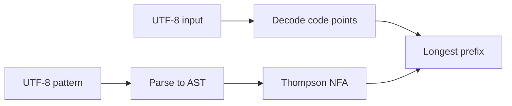

# UTF-8 common regex engine

#3 — [UTF-8 host strings and Thompson NFA regex engine in lovelace_common](https://github.com/sanelli/lovelace/issues/3)

Branch: `feature/3-utf8-regex-engine`

Do not implement a Lovelace lexer or `compiler/` tokenizer; only the host regex engine and tests that a pattern exists for each token class below.

## 1. Create GitHub issue

Done: [#3](https://github.com/sanelli/lovelace/issues/3).

## 2. Create feature branch

Done: `feature/3-utf8-regex-engine` (based on `feature/1-host-alire-bootstrap`; includes unstaged workflow tweak commenting out `push` on `main` in [`.github/workflows/build.yml`](.github/workflows/build.yml)).

## 3. Save the plan

Done: [`.cursor/plans/3-utf8-regex-engine.plan.md`](.cursor/plans/3-utf8-regex-engine.plan.md).

## 4. Update Cursor rules first

Done: always-apply [`.cursor/rules/utf8-and-naming.mdc`](.cursor/rules/utf8-and-naming.mdc); crate names and UTF-8 on [`alire.mdc`](.cursor/rules/alire.mdc), [`lovelace-project.mdc`](.cursor/rules/lovelace-project.mdc), [`ada-standards.mdc`](.cursor/rules/ada-standards.mdc), and sibling rules.

## 5. Enable UTF-8 Ada sources in host switches

Done: `-gnatW8` in [`shared/lovelace_host_switches.gpr`](shared/lovelace_host_switches.gpr).

## 6. Create crate `lovelace_common` in `common/`

Done: crate `lovelace_common` with [`common/alire.toml`](common/alire.toml), [`common/lovelace_common.gpr`](common/lovelace_common.gpr) (`Library_Kind use "static"`), packages `Lovelace`, `Lovelace.Utf_8` (GNAT `-gnatyD` Mixed_Case; not `UTF_8`), and `Lovelace.Regex` (Thompson NFA, code-point classes, `Compile` / `Match_Prefix`). `alr -C common build` succeeds.

## 7. Nested AUnit crate `common/tests`

Done: crate `lovelace_common_tests` under [`common/tests/`](common/tests/) with AUnit, pin to `lovelace_common`, shared host switches. Fixtures cover engine mechanics (literal, concat, alt, quantifiers, classes, offsets, invalid patterns, UTF-8/`\u{…}`) and one pattern per token class (comments, strings, chars, ops, punct, keywords, parens, identifiers), including glued vs spaced inputs. `alr -C common/tests run` — 20/20 OK. Non-ASCII test data uses `Wide_Wide_String` + `Utf_8.Encode` (GNAT `-gnatW8` rejects emoji in `String` literals).

## 8. Document under `docs/`

Done: [`docs/regex-engine.md`](docs/regex-engine.md) covers UTF-8 conventions, regex syntax / `Match_Prefix`, and that this is not the Lovelace lexer. README Status section links to it. Public Ada APIs stay on the specs (GNATdoc).

## 9. Wire the workspace

Done: root [`alire.toml`](alire.toml) `depends-on` + pin `lovelace_common = { path = "common" }`; [`lovelace_workspace.gpr`](lovelace_workspace.gpr) includes `common/lovelace_common.gpr`. No `depends-on` from the `lovelace` executable to `lovelace_common` yet.

## 10. Run all tests

Done (2026-09-06):

- `alr build` at repo root — success (`lovelace_workspace`; includes `lovelace` + `lovelace_common`).
- `alr -C common build` — success.
- `alr -C common/tests run` — **20/20** Successful Tests, 0 failed assertions, 0 unexpected errors.

No other nested AUnit crates exist; that is the full suite.

## 11. Push and open a PR

Done: branch pushed; PR opened with `gh pr create` (closes #3).
