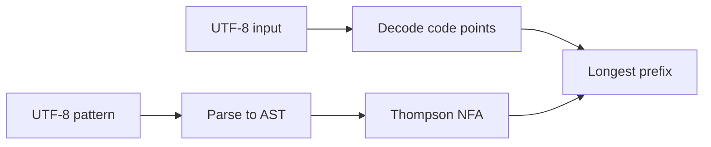

# UTF-8 common regex engine

#3 — [UTF-8 host strings and Thompson NFA regex engine in lovelace_common](https://github.com/sanelli/lovelace/issues/3)

Branch: `feature/3-utf8-regex-engine`

Do not implement a Lovelace lexer or `compiler/` tokenizer; only the host regex engine and tests that a pattern exists for each token class below.

## 1. Create GitHub issue

Done: [#3](https://github.com/sanelli/lovelace/issues/3).

## 2. Create feature branch

Done: `feature/3-utf8-regex-engine` (based on `feature/1-host-alire-bootstrap`; includes unstaged workflow tweak commenting out `push` on `main` in [`.github/workflows/build.yml`](.github/workflows/build.yml)).

## 3. Save the plan

Done: [`.cursor/plans/3-utf8-regex-engine.plan.md`](.cursor/plans/3-utf8-regex-engine.plan.md).

## 4. Update Cursor rules first

Follow the create-rule format (YAML frontmatter, `.mdc` under [`.cursor/rules/`](.cursor/rules/)). **Rules before Ada.** Keep folder names (`common/`, `compiler/`, …) as they are; change **crate** and **package** names.

**Crate names** (update [`alire.mdc`](.cursor/rules/alire.mdc), [`lovelace-project.mdc`](.cursor/rules/lovelace-project.mdc), and every other rule that still says crate `common` / `compiler` / …):

- Every Alire crate name starts with `lovelace`, in any folder. Examples: folder [`common/`](common/) → crate **`lovelace_common`**, GPR **`lovelace_common.gpr`**. Nested tests → **`lovelace_common_tests`**. CLI stays **`lovelace`**; workspace stays **`lovelace_workspace`**. Future host libraries: `lovelace_lir`, `lovelace_compiler`, `lovelace_tooling`, `lovelace_format`, `lovelace_alexandria`, `lovelace_hypatia`, `lovelace_jit`. Augusta native, when created: `lovelace_augusta`.
- GPR file name still matches the crate (Alire). Update the layering `depends-on` table to these names (`lovelace_lir` depends on `lovelace_common`, and so on). Pin paths stay folder-relative (`common`, `../common`).

**Package names:** every Ada package starts with `Lovelace` (child units: `Lovelace.Regex`, not `Regex_Automata`). Root namespace `package Lovelace` lives in `lovelace_common`. Note in the rule that `procedure Lovelace` in [`lovelace/src/lovelace.adb`](lovelace/src/lovelace.adb) **must** become a child (e.g. `Lovelace.Main`) **before** the CLI crate depends on `lovelace_common` (parent/child name clash). Do **not** rename the CLI in this work.

**UTF-8** (extend [`ada-standards.mdc`](.cursor/rules/ada-standards.mdc); always-apply summary so it is visible without an Ada file open):

- Host string manipulation uses UTF-8. Ada `String` / `Unbounded_String` are UTF-8 **byte** sequences, not Latin-1 code units. Do not treat `Character` as a Lovelace character.
- Lovelace **string** literals are stored as UTF-8. Lovelace **character** literals are one Unicode scalar stored in 4 bytes (`Wide_Wide_Character` / a `Code_Point` subtype).
- `.love` and Ada sources are UTF-8 (identifiers and literals may include emoji). GNAT: `-gnatW8` on the shared host switch list.

## 5. Enable UTF-8 Ada sources in host switches

Add `-gnatW8` to [`shared/lovelace_host_switches.gpr`](shared/lovelace_host_switches.gpr) (do not copy the switch list into crate GPRs).

## 6. Create crate `lovelace_common` in `common/`

Hand-write (no extra skeleton beyond what Alire needs):

- [`common/alire.toml`](common/alire.toml) — name `lovelace_common`, MIT, author Stefano Anelli, static library, `auto-gpr-with = false`, `"*".style_checks = "No"`, no sibling `depends-on`.
- [`common/lovelace_common.gpr`](common/lovelace_common.gpr) — `library project`; `Library_Kind use "static"`; `with` [`../shared/lovelace_host_switches.gpr`](shared/lovelace_host_switches.gpr) and Alire config GPR; concatenate switches like [`lovelace/lovelace.gpr`](lovelace/lovelace.gpr).

**Packages** (spec comments on every public entity):

- `Lovelace` — empty root namespace.
- `Lovelace.UTF_8` — decode/encode between UTF-8 `String` and `Wide_Wide_Character` (`Code_Point`). Iterate code points with a byte index into a UTF-8 string. Invalid UTF-8 in a **pattern** is a compile error; invalid UTF-8 in **input** does not match. No third-party Unicode DB.
- `Lovelace.Regex` — Thompson NFA, same role as EML [`regex_automata.ads`](/Users/stefano/devel/repos/eml/src/regex_automata.ads): `Compile` + `Match_Prefix`. **Do not** copy that unit as Latin-1 `Character` / `array (Character) of Boolean` (256-wide classes cannot represent emoji).

**Engine API**

- `function Compile (Pattern : String) return Engine` — pattern is UTF-8; raise `Regex_Error` on bad syntax or invalid UTF-8.
- `function Match_Prefix (E : Engine; Input : String; From : Positive) return Natural` — longest **UTF-8 byte** length of an accepting match starting at `Input (From)`, same empty-match rule as EML (empty-only → `0`). Callers slice `Input (From .. From + N - 1)`.

**Syntax** (EML subset, code-point based): concatenation, `|`, `*`, `+`, `?`, `(…)`, `[…]` / `[^…]` with ranges on **code points**, escapes for metacharacters. Extensions required for Lovelace:

- `.` — any code point including newline (lexer-friendly).
- Pattern and class escapes: `\n`, `\t`, `\r`, `\f`, `\e`, `\\`, and `\u{hex}` (Unicode scalar, up to U+10FFFF).
- Character classes stored as code-point **ranges** (plus a negated flag), not a 256-bit map.

No captures, backreferences, lookahead, or `{n,m}` quantifiers (braces stay ordinary literals unless escaped). Reimplement Thompson construction (epsilon / symbol / class transitions) using indices or containers rather than leaking access lists if practical.

## 7. Nested AUnit crate `common/tests`

Crate name **`lovelace_common_tests`**: own `alire.toml`, pin `{ path = ".." }`, `depends-on` `lovelace_common` and **AUnit only here**. `with` the shared host switches GPR. AUnit fixtures/test cases, not `Put_Line` drivers. Ada test sources are UTF-8 (emoji in string literals).

Cover (1) engine mechanics like EML’s tests (literal, concat, alt, `*`/`+`/`?`, classes, negation, offsets, invalid patterns) including **emoji / multi-byte** literals and `\u{…}`, and (2) **one pattern per Lovelace token class** below — compile, `Match_Prefix` on representative inputs, including **no space** between tokens (e.g. `+` inside `a+b`) and **with** spaces/tabs. This is not a tokenizer: no token stream, no `compiler/` code.

Token classes to prove with regex (non-nested `{`…`}` comments; no language parser):

- Block comments `{` … `}` spanning lines: e.g. `\{[^}]*\}`.
- Single-line strings `"…"` with escapes `\\`, `\n`, `\"`, `\'`, `\e`, `\r`, `\f`, `\u{hex}` (and reject an unescaped newline in the match for this pattern).
- Multiline strings `@"…"` : `@"[^"]*"`.
- Interpolated `$"…"` with `{varName}` holes (varName uses the identifier pattern).
- Combined `$@"…"` (multiline + interpolation).
- Character literals `'…'` (one code point or one escape), including emoji and `\u{…}`.
- Operators `+ - * / %` (escaped where needed).
- Punctuation `; , .`
- Keywords as an alternation of at least: `program`, `function`, `procedure`, `begin`, `end`, `const`, `vars`, `declare`, `and`, `or`, `not`, `if`, `then`, `else`, `loop`, `for`.
- Parentheses `( ) [ ] < >`.
- Identifiers: one-or-more printable code points that are not whitespace, not the delimiter/operator/paren/quote/`{`/`}` set, and **not starting with `[0-9]`**; must match emoji and other UTF-8 (e.g. `café`, `🚀go`).

Whitespace between tokens is optional: tests for `program` / `+` / identifiers must succeed both glued and separated by space/tab.

## 8. Document under `docs/`

Add a short host page (e.g. [`docs/regex-engine.md`](docs/regex-engine.md)): regex syntax, UTF-8 byte lengths, code-point classes, and that this is **not** the Lovelace lexer. Point the README at it in one line if the status/build section is touched. Public Ada APIs stay documented on the specs.

## 9. Wire the workspace

Root [`alire.toml`](alire.toml): `[[depends-on]]` + `[[pins]]` for `lovelace_common = { path = "common" }` in addition to `lovelace`. [`lovelace_workspace.gpr`](lovelace_workspace.gpr): add `common/lovelace_common.gpr` to `Project_Files`. Do **not** add `depends-on` from the `lovelace` executable to `lovelace_common` yet (avoids `procedure Lovelace` vs `package Lovelace`).

## 10. Run all tests

`alr build` at the repo root (workspace includes `lovelace_common`). Run the nested crate (`alr -C common/tests` build/test as Alire+AUnit require). Record results. If no other test crates exist, that is the full suite.

## 11. Push and open a PR

`git push` / `gh pr create` with proxy env vars cleared and `all` permissions (see agent-workflow). PR closes #3.
