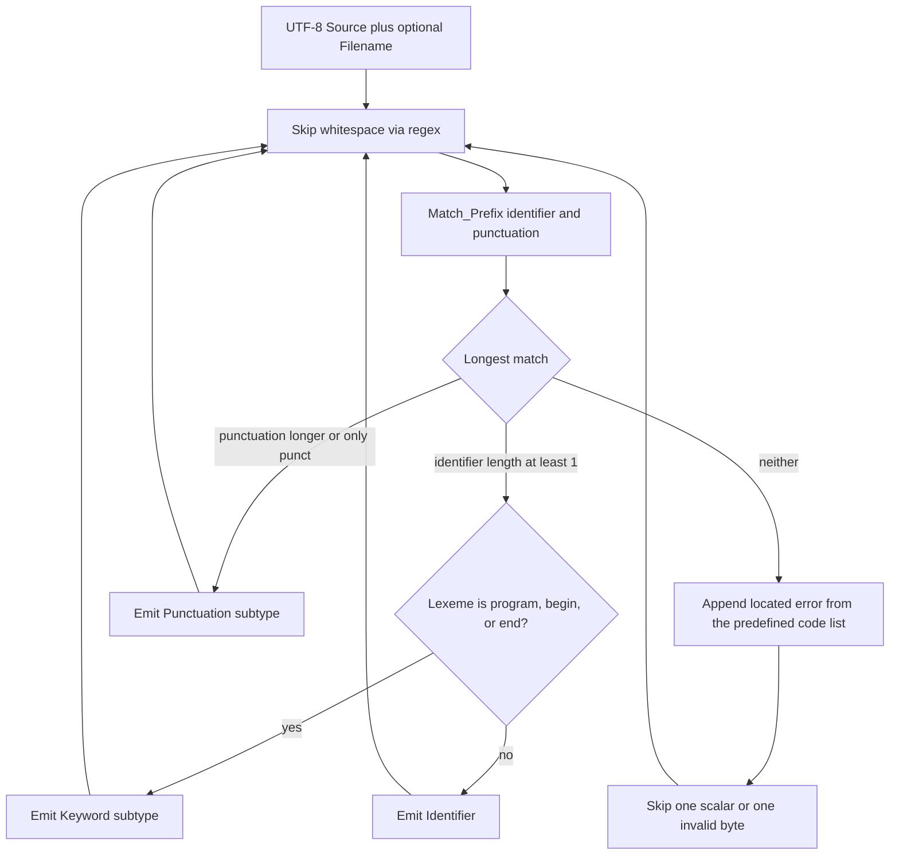

# Compiler tokenizer (keywords, identifiers, punctuation)

#5 — [Compiler tokenizer for program, begin, end, identifiers, and punctuation](https://github.com/sanelli/lovelace/issues/5)

Branch: `feature/5-compiler-tokenizer` (linked to #5; **policy:** always create linked branches from `main` — this branch predates that rule and was cut from `feature/3-utf8-regex-engine`).

Depends on the `lovelace_common` regex engine from [#3](https://github.com/sanelli/lovelace/issues/3). Do **not** implement a parser, string/number/comment tokens, CLI wiring, or `lovelace` → `lovelace_compiler` `depends-on`.



## Scope decisions (locked for this issue)

- **Token kinds only:** `Keyword`, `Identifier`, `Punctuation`. No `StringLiteral`, `NumericLiteral`, `Character`, comments, or operators. A comma, plus, quote, or digit-only run is an **error**, not a token.
- **Keyword values (case-sensitive):** `program`, `begin`, `end`. `Program` / `BEGIN` / `End` are identifiers.
- **Keyword reservation:** match a full identifier first, then classify. `programmer` is one identifier, not `program` + `mer`. `programbegin` is one identifier.
- **Punctuation tokens:** `;` → `Semicolon`, `.` → `Full_Stop`. No comma token in this slice.
- **Whitespace / any space between tokens:** tokens may be separated by **any** kind of space. All such separators are **ignored** (consumed, not emitted, not part of the previous or next token). That includes ASCII space/tab/LF/CR/FF, Unicode space separators (`Is_Space`), and line terminators (`Is_Line_Terminator`): NBSP, ideographic space, and similar. Adjacent tokens with no space (`end;`) are also valid. The only future exception is spaces **inside string literals**; string literals are **not** defined in this plan, so this slice has no “keep these spaces” path.
- **Errors:** predefined, expandable **error-code enum**; collect **all** user-source errors in one pass (do not stop at the first). No error tokens. No `null`. `Result` failure is reserved for a compiler-internal regex-compile bug only.
- **Lexeme text:** not stored on the token. Recover with `Source (First_Byte .. Last_Byte)`. A helper `Lexeme (Source, The_Token)` may slice that range.
- **Empty source / only whitespace:** success, empty token sequence, empty error list.

## Identifier rules (source of truth)

Scan Unicode **scalars** via [`Lovelace.Common.Utf_8`](common/src/lovelace-common-utf_8.ads) (never treat `Character` as a Lovelace character).

**Continue character** (after the first):

- Valid UTF-8 scalar (surrogates already rejected by `Utf_8.Decode`).
- `Ada.Wide_Wide_Characters.Handling.Is_Graphic`.
- Not `Is_Space`, not `Is_Control`, not `Is_Line_Terminator`, not `Is_Other_Format` (rejects ZWJ and similar; a family-emoji ZWJ sequence is not one identifier).
- Not punctuation, except `_` (allowed anywhere).
- Not `@`.

**First character:** same as continue, except:

- Must not be ASCII `0`..`9` (only `[0-9]`; other Unicode numbers such as `٢` may start an identifier).
- May be `@`, but then **at least one** continue character is required (`@` alone is `Unrecognized_Symbol`; skip `@` and continue).
- `@` is legal **only** as this prefix (`@foo` is an identifier; `foo@bar` is identifier `foo`, then `Unrecognized_Symbol` at `@`, then identifier `bar`).

**Punctuation inventory** (disallowed in identifiers, even if this tokenizer has no token for them): every ASCII graphic that is not letter, digit, or `_` (`! " # $ % & ' ( ) * + , - . / : ; < = > ? @ [ \ ] ^ ` { | } ~`), plus Unicode general-category punctuation ranges documented in the tokenizer body (General Punctuation punctuation, CJK punctuation, and the other standard punctuation blocks). Emoji and other **symbols** (`🍎`, `🐭`, `🚀`) are allowed. Letters with diacritics (`café`) are allowed.

Implement one shared table of excluded punctuation ranges. Use it both to **build** the identifier regex and to **validate** each scalar so regex and Ada cannot drift.

Ada reserved words: keyword subtypes cannot be named `Begin` or `End`. Use `Program_Keyword`, `Begin_Keyword`, `End_Keyword`.

## Token shape (subtypes only on the matching kind)

Discriminated record so a `Keyword` subtype field does not exist on `Identifier`:

```ada
type Token_Kind is (Keyword, Identifier, Punctuation);

type Keyword_Subtype is (Program_Keyword, Begin_Keyword, End_Keyword);
type Punctuation_Subtype is (Semicolon, Full_Stop);

type Token (Kind : Token_Kind) is record
   Span     : Source_Span;
   Filename : Filename_Options.Option;
   case Kind is
      when Keyword =>
         Keyword_Value : Keyword_Subtype;
      when Punctuation =>
         Punctuation_Value : Punctuation_Subtype;
      when Identifier =>
         null;  --  no subtype field (this is "None")
   end case;
end record;
```

`when Identifier => null` is a variant with no components, not a pointer. Clients `case` on `Kind` (both arms of any `Result` / `Option` as well).

Do **not** give `Kind` a default (`:= Identifier` is not required). Every token is built with an explicit discriminant (`Token'(Kind => Keyword, …)`). A default would only make it easier to declare an unconstrained object that silently becomes an identifier; it does not make the type definite.

`Token` is still indefinite (discriminated record, plus `Option` on `Filename`). Store tokens in `Ada.Containers.Indefinite_Vectors`. Wrap the vector in a **definite** `Token_Sequence` so it can be a `Result` success payload (`Lovelace.Common.Result` requires `is private` / definite types).

**Source location** (diagnostics will need line/column later; store both bytes and scalars now):

- `Source_Position`: 1-based `Byte_Index`, `Line`, `Column` (column counts Unicode scalars on the line, not bytes; tab is one column).
- `Source_Span`: inclusive `First` and `Last` positions of the token’s first and last scalars.

## Shared filename (no duplication, no public null)

Create [`Lovelace.Common.Option`](common/src/lovelace-common-option.ads) (missing today):

```ada
generic
   type Element_Type is private;
package Lovelace.Common.Option is
   type Option (Present : Boolean := False) is record
      case Present is
         when True =>
            Value : Element_Type;
         when False =>
            null;
      end case;
   end record;
   function None return Option;
   function From_Value (Value : Element_Type) return Option;
end Lovelace.Common.Option;
```

Filename sharing lives in the compiler (not a second common abstraction unless a tiny private type is enough): a **refcounted, immutable** `Shared_Filename` / `Holder` (controlled). `From_Utf_8` allocates once; assigning a token copies only the holder; the UTF-8 bytes are not duplicated. Never mutate the payload. `Same_Storage (Left, Right)` is `True` when two holders point at the same buffer (for tests). Default/absent filename is `Option` with `Present => False` — do not use `null` access in the public API.

`Tokenize (Source, Filename)` : if filename is present, create **one** holder and store that same holder in every token **and** every tokenizer error. If omitted, every token and error has `Filename` = `None`.

## Tokenizer errors (predefined list, expandable)

User-source problems are **not** `Internal_Error` codes. They use a closed enum that later work can extend (unterminated string, invalid escape, and so on). Do not invent a `L0001`-style diagnostic prefix yet (diagnostics rule: keep the structure, prefix TBC).

Initial codes, named after common language lexers (Clang/GCC “stray / unexpected character”, Rust “unknown start of token”, Go “illegal character U+…”, C# “Unexpected character”, Python “invalid character”):

- `Unrecognized_Symbol` — a valid UTF-8 scalar that is not whitespace and does not start any token in this slice (`+`, `,`, `"`, `$`, a lone `@`, a leading ASCII digit, …). Message along the lines of `unrecognized symbol '+'` (show `\u{…}` when the scalar is not printable ASCII).
- `Invalid_Utf_8` — bytes that are not a UTF-8 sequence. Message along the lines of `invalid UTF-8 sequence`.

```ada
type Tokenizer_Error_Code is (Unrecognized_Symbol, Invalid_Utf_8);

type Tokenizer_Error is record
   Code     : Tokenizer_Error_Code;
   Span     : Source_Span;
   Filename : Filename_Options.Option;
   Detail   : Ada.Strings.Unbounded.Unbounded_String;
end record;
```

`Tokenizer_Error` is definite so it can live in a vector and on the tokenize output. Adding a new code later is an enum extension plus a recovery rule; callers `case` on `Code` and must keep handling every literal.

**Do not stop at the first error.** Append the error, recover, and keep scanning so one `Tokenize` call reports every problem it can:

- `Unrecognized_Symbol`: skip **one scalar**, continue (so `program + begin $ end.` yields tokens `program`, `begin`, `end`, `.` and two `Unrecognized_Symbol` errors).
- `Invalid_Utf_8`: skip **one byte** (or the rejected sequence length from `Utf_8` when it is known and at least 1) so the loop cannot stall, then continue. A broken sequence may therefore produce more than one `Invalid_Utf_8` if later bytes are also invalid.

Do **not** emit an error token. The output is always the tokens recognized plus the error list (the list may be empty).

**Internal vs user:** a failed `Compile` of a hardcoded pattern is still `Lovelace.Common.Internal_Error` (`Regex_Compile`) and is the only `Tokenize` `Result` failure — the engine cannot run. Always `case` both `Ok` arms.

## Tokenizer algorithm (must use `Lovelace.Common.Regex`)

Package [`Lovelace.Compiler.Tokenizer`](compiler/src/lovelace-compiler-tokenizer.ads). Compile these patterns **once** (cached in the package body; first `Tokenize` call). A failed `Compile` of a hardcoded pattern is a compiler bug: `Lovelace.Common.Internal_Error` group such as `Regex_Compile`, returned as `Tokenize` `Result` failure (not a user diagnostic code).

| Role | Pattern idea |
| --- | --- |
| Whitespace | ASCII `[ \t\n\r\f]` plus documented Unicode space/line-separator `\u{…}` ranges, then `+` |
| Punctuation | `;|\.` |
| Identifier | `(@)?` + first-class + rest-class `*` where classes are negated unions of whitespace, the punctuation table, `@` (rest), and `[0-9]` (first only). Emit classes as `\u{…}` ranges so `[` `]` `-` `^` cannot break the regex parser |

Loop at byte `Position`:

1. `Match_Prefix (Whitespace, Source, Position)` — advance and continue. Any run of space (ASCII or Unicode) only separates tokens; it is discarded. Do not attach it to the surrounding tokens. String-literal-internal spaces are out of scope (no string tokens in this plan).
2. `Id_Length := Match_Prefix (Identifier, …)`, `Punct_Length := Match_Prefix (Punctuation, …)`.
3. If both are 0: `Utf_8.Decode` at `Position`. Invalid sequence → append `Invalid_Utf_8`, skip one byte (or known sequence length), **continue**. Valid scalar → append `Unrecognized_Symbol` (detail includes the scalar), skip that scalar, **continue**.
4. If `Punct_Length > 0` and `Punct_Length >= Id_Length` (punctuation is length 1): emit `Semicolon` or `Full_Stop` from the matched byte.
5. Else take the identifier prefix, decode scalars, and **truncate** at the first scalar that fails the Ada predicate (Unicode punctuation the regex class missed). If truncated length is 0, treat as step 3 (`Unrecognized_Symbol` or `Invalid_Utf_8`) and continue.
6. If the lexeme bytes are exactly `program` / `begin` / `end`, emit the matching `Keyword_*`; else `Identifier`.
7. Advance `Position` by the byte length; maintain line/column when consuming LF / CR / CRLF (treat CRLF as one line break) and when skipping for recovery.

`Match_Prefix` already returns **byte** length and refuses invalid UTF-8.

Public API sketch:

```ada
type Tokenize_Output is record
   Tokens : Token_Sequence;
   Errors : Tokenizer_Error_Sequence;
end record;

function Tokenize (Source : String) return Tokenize_Result;
function Tokenize (Source : String; Filename : String) return Tokenize_Result;
```

`Tokenize_Result` is `Result` of `Tokenize_Output` or internal `Regex_Compile` failure. On `Ok`, callers inspect `Value.Errors`: empty means a clean tokenize; non-empty still includes every token recognized after recovery. Second overload is the “filename present” path (`From_Value` on the shared holder, used by tokens and errors).

## Crate and packages

Create crate **`lovelace_compiler`** in [`compiler/`](compiler/) (`Library_Kind use "static"`, `with` [`shared/lovelace_host_switches.gpr`](shared/lovelace_host_switches.gpr), pin `lovelace_common = { path = "../common" }`). Packages:

- `Lovelace.Compiler` — empty crate root (same pattern as [`Lovelace.Common`](common/src/lovelace-common.ads)).
- `Lovelace.Compiler.Tokens` — kinds, subtypes, `Source_Position` / `Source_Span`, `Token`, `Lexeme`, shared-filename type, `Filename_Options` instantiation.
- `Lovelace.Compiler.Tokenizer` — `Tokenizer_Error_Code`, `Tokenizer_Error`, error/token sequences, `Tokenize_Output`, `Tokenize`, `Tokenize_Result`.

Wire [`alire.toml`](alire.toml) and [`lovelace_workspace.gpr`](lovelace_workspace.gpr) to pin/build `compiler/`. Append `{ Name = 'compiler'; ProjectFile = 'compiler/lovelace_compiler.gpr' }` in [`scripts/gnatdoc.ps1`](scripts/gnatdoc.ps1). Do **not** add a `lovelace` executable dependency.

Nested crate [`compiler/tests`](compiler/tests/) = `lovelace_compiler_tests` (AUnit only here; pin `{ path = ".." }`; `with` host switches).

GNATdoc leading comments on every new spec (`@field` / `@disc` / `@enum` / `@param` / `@return`). After Ada edits: `alr exec -- gnatformat -w 120 -P <crate.gpr> <files>`.

## Tests (required in the same change)

**`common/tests`:** `Option` — `None` / `From_Value`, both `Present` arms, no reading `Value` when absent.

**`compiler/tests` (AUnit fixtures):**

- Empty and whitespace-only (ASCII and Unicode spaces) → empty sequence. Spaces never become tokens.
- Tokens separated by any space kind (space, tab, LF, CR, mixed, Unicode NBSP) produce the same sequence as the same tokens glued or spaced with ASCII blanks. Example: `program begin end.` → three keywords + `Full_Stop`; spans and line/column.
- Glued vs spaced punctuation (`end;` and `end ;`) is the same two tokens.
- Case: `Program` / `BEGIN` are identifiers.
- `programmer` is one identifier; `programbegin` is one identifier.
- Identifiers: `name`, `foo_bar`, `_x`, `foo2`; reject `2foo` and `2`; `café` and emoji start/contain (build via `Utf_8.Encode` / `Wide_Wide_String`, not `String` literals — `-gnatW8` / Latin-1 trap, same as [`docs/regex-engine.md`](docs/regex-engine.md)).
- `@foo` identifier; `@` alone → one `Unrecognized_Symbol`, no identifier token; `foo@bar` → identifier `foo`, `Unrecognized_Symbol` at `@`, identifier `bar`; `_` allowed; `$` `%` `^` `~` `'` `?` are `Unrecognized_Symbol` (not identifier characters).
- Newline updates `Line` / `Column`; multi-byte token byte span covers the full UTF-8 sequence.
- Filename omitted vs provided; every token **and** every error `Same_Storage` as the first; mutating nothing.
- Single `Unrecognized_Symbol` for `+`, `,`, `"`; `2` and `2foo` (`2` is unrecognized, then `foo` may still tokenize).
- **Multi-error:** `program + begin $ end.` → tokens `program`, `begin`, `end`, `.` and two `Unrecognized_Symbol` errors (does not stop at `+`).
- Invalid UTF-8 byte → `Invalid_Utf_8` at that location; scanning continues after the skipped byte (further tokens/errors still reported).
- Clean input (`begin`) → empty error list. Built-in patterns compile (indirectly).

## Documentation

- New [`docs/tokenizer.md`](docs/tokenizer.md): API, token kinds/subtypes, identifier rules, **any space between tokens is ignored**, note that string literals (later) will keep internal spaces, **error-code list** (expandable), multi-error recovery, filename sharing, “not yet tokenized” list.
- Point [`docs/regex-engine.md`](docs/regex-engine.md) “Not the Lovelace lexer” at the tokenizer.
- Short token grammar note under `docs/` (this slice only).
- README Status: link the tokenizer doc.

## 1. Create GitHub issue

Done: [#5](https://github.com/sanelli/lovelace/issues/5).

## 2. Create and check out the feature branch

Done: `feature/5-compiler-tokenizer` (based on `feature/3-utf8-regex-engine`), linked to [#5](https://github.com/sanelli/lovelace/issues/5) via GraphQL `createLinkedBranch` (see agent-workflow rule — plain `git checkout -b` does not link; `gh issue develop` cannot attach an existing remote branch).

## 3. Save the plan

Done: [`.cursor/plans/5-compiler-tokenizer.plan.md`](.cursor/plans/5-compiler-tokenizer.plan.md).

## 4. Add `Lovelace.Common.Option` and AUnit tests

Done: [`Lovelace.Common.Option`](common/src/lovelace-common-option.ads) plus AUnit fixtures in `common/tests` (23 tests).

## 5. Create crate `lovelace_compiler`

Done: [`compiler/alire.toml`](compiler/alire.toml), [`compiler/lovelace_compiler.gpr`](compiler/lovelace_compiler.gpr), empty [`Lovelace.Compiler`](compiler/src/lovelace-compiler.ads); workspace and [`scripts/gnatdoc.ps1`](scripts/gnatdoc.ps1) wired; `depends-on` / pin `lovelace_common` only.

## 6. Implement token types, spans, and shared filename

Done: [`Lovelace.Compiler.Source`](compiler/src/lovelace-compiler-source.ads) (spans, positions, refcounted shared filename, `Filename_Option`); [`Lovelace.Compiler.Tokens`](compiler/src/lovelace-compiler-tokens.ads) (kinds, discriminant-safe subtypes, indefinite `Token` in `Token_Sequence`, `Lexeme`). GNATdoc on both specs.

## 7. Implement the tokenizer

Done: [`Lovelace.Compiler.Tokenizer`](compiler/src/lovelace-compiler-tokenizer.ads) — cached whitespace/identifier/punctuation regex engines, skip-all-space loop, keyword classification, `Truncate_Identifier_Length` Ada validation, `Tokenizer_Error_Code` including `Internal_Error`. `Tokenize_Result` success is a `Token_Sequence`; failure is a `Tokenizer_Error_Sequence`.

## 8. Nested AUnit crate `compiler/tests`

Done: crate `lovelace_compiler_tests` with 19 AUnit fixtures for the token matrix. Non-ASCII via `Utf_8.Encode`. `Tokenize_Result` is tokens-or-errors, so mixed cases assert the error list only.

## 9. Document under `docs/`

Done: [`docs/tokenizer.md`](docs/tokenizer.md), [`docs/token-grammar.md`](docs/token-grammar.md), regex-engine “Not the Lovelace lexer” points at the tokenizer, README Status links both.

## 10. Run all tests that exist

Done:

- `alr build` at repo root — success
- `alr -C common/tests run` — 23/23
- `alr -C compiler/tests run` — 19/19

## 11. Push and open a PR

Push with proxy env cleared; `gh pr create` referencing `#5`. Commit messages start with `#5`.
