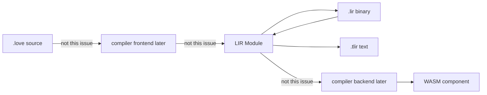
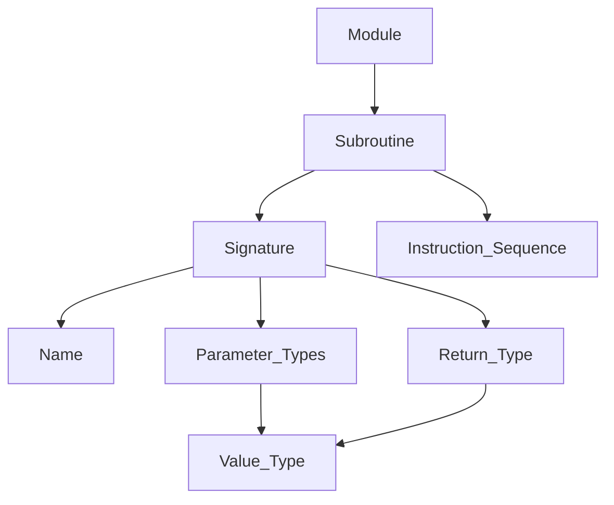

# Lovelace Intermediate Representation crate

#7 — [Create lovelace_lir crate with versioned .lir and .tlir formats](https://github.com/sanelli/lovelace/issues/7)

Branch: `feature/7-lir-crate` (linked to #7 from `main` via `gh issue develop`).

Plan file: [`.cursor/plans/7-lir-crate.plan.md`](7-lir-crate.plan.md).

**Out of scope:** `.love` parser, AST→LIR lowering, analysis/opt passes, extra opcodes, `.tlir` parser, `lovelace_compiler` `depends-on` `lovelace_lir`, CLI commands, WASM/WIT emission.

Existing layout already reserves crate `lovelace_lir` in [`lir/`](../../lir/) ([`.cursor/rules/alire.mdc`](../rules/alire.mdc), [`.cursor/rules/utf8-and-naming.mdc`](../rules/utf8-and-naming.mdc)). The folder is empty today. Mirror [`compiler/`](../../compiler/) for Alire/GPR/tests: static library, `with` [`shared/lovelace_host_switches.gpr`](../../shared/lovelace_host_switches.gpr), nested `lir/tests` crate `lovelace_lir_tests` with AUnit only there.





## Locked design

- **Machine model:** LIR is a stack machine with a sequential (linear) byte memory, in the same spirit as WASM core. The operand stack is implicit at run time and is not stored in the module. Values on the stack and in signatures use the closed `Value_Type` set below. This slice does not declare linear-memory size or locals; document those as future fields. Opcodes are **Lovelace** 16-bit codes, not WASM bytes. The backend will lower LIR to WASM later ([`.cursor/rules/compiler-pipeline.mdc`](../rules/compiler-pipeline.mdc)). `I128`, `U128`, and `F16` exist in LIR now; mapping them to WASM is a later backend problem.
- **Value types (closed set):** `unit`; signed integers `i8` `i16` `i32` `i64` `i128`; unsigned integers `u8` `u16` `u32` `u64` `u128`; floating point `f16` `f32` `f64`. **No `void` type** — ever. No references or aggregates in this slice. A subroutine that returns `unit` is a procedure for the Lovelace backend (nothing on the operand stack).
- **Subroutine signature:** every subroutine has a `Signature` with **name** (UTF-8), **return type** (mandatory `Value_Type`; use `Unit` for procedures), and **parameter types** (zero or more `Value_Type`, unnamed in this slice). Name lives on the signature, not as a second field beside it.
- **Instruction encoding:** the **opcode is always 2 bytes** (little-endian `u16`) in the encoded stream. Immediate operands may follow; total instruction length varies by opcode. `No_Operation` has no immediates, so its encoded size is exactly 2 bytes (`00 00`). Ada records may be larger than 2 bytes; `Encoded_Length` reports stream size.
- **Flags, not tags:** module metadata is a `u32` bitset (`Module_Flags`). No bits assigned yet (`0`). Subroutine flags are a separate `u32` bitset (`Subroutine_Flags`): bit 0 `Export`, bit 1 `Entrypoint`. These are flags, never strings.
- **Names:** UTF-8. Binary strings are length-prefixed (never C strings). Text strings are quoted.
- **I/O without `raise`:** build/parse a byte vector in memory; file wrappers use `GNAT.OS_Lib` file descriptors (failure via `Invalid_FD` / write length, not exceptions). `Print` uses `Ada.Text_IO` (RTS may still fail).
- **Do not** add `lovelace_compiler` → `lovelace_lir` until lowering exists (same deferral as the tokenizer vs CLI). Pin `lovelace_lir` on `lovelace_workspace` so root `alr build` compiles it.

## In-memory types

Packages under `Lovelace.Lir` (crate namespace `Lovelace.Lir` like [`Lovelace.Compiler`](../../compiler/src/lovelace-compiler.ads)):

- [`lir/src/lovelace-lir.ads`](../../lir/src/lovelace-lir.ads) — crate root.
- `Lovelace.Lir.Types` — closed `Value_Type` enumeration with WASM-like literals (domain names, not invented abbreviations):

```ada
type Value_Type is
  (Unit,
   I8, I16, I32, I64, I128,
   U8, U16, U32, U64, U128,
   F16, F32, F64);
```

  Representation values are the binary `u8` codes (0 through 13 in that order). `To_Code` / `From_Code`. Sequence type for parameter lists (`Empty`, `Append`, `Length`, `Element`). `Value_Type_Options` only for `From_Code` failure (unknown code).
- `Lovelace.Lir.Opcodes` — `type Opcode is (No_Operation);` with `for Opcode use (No_Operation => 0);` and `for Opcode'Size use 16`. Helpers: `To_Word` / `From_Word` (`Interfaces.Unsigned_16`), `Immediate_Length` (0 for `No_Operation`), `Encoded_Length` (2 + immediates). Unknown words are not an `Opcode`; decode fails in the binary layer.
- `Lovelace.Lir.Instructions` — discriminated `Instruction (Operation : Opcode := No_Operation)` with `when No_Operation => null`. Sequence type with `Empty`, `Append`, `Length`, `Element` (same pattern as [`Lovelace.Compiler.Tokens`](../../compiler/src/lovelace-compiler-tokens.ads)).
- `Lovelace.Lir.Subroutines` — `Signature` record (`Name`, `Return_Type : Value_Type`, `Parameter_Types`), `Flags`, instruction sequence. Builders: `Create (The_Signature, Flags)`, `Append_Instruction`, accessors. Constants `Export_Flag : constant Subroutine_Flags := 2 ** 0`, `Entrypoint_Flag : constant Subroutine_Flags := 2 ** 1`. Duplicate subroutine names are still keyed by `Signature.Name`.
- `Lovelace.Lir.Modules` — name, `Flags` (`mod 2**32`, no named bits), dependency-name sequence, subroutine sequence. Builders: `Create (Name)`, `Append_Dependency`, `Append_Subroutine`.
- `Lovelace.Lir.Binary` — encode/decode byte sequences; `Write` / `Read` `.lir` files. `Result` for both cases (`Internal_Error` first on the error-code enum).
- `Lovelace.Lir.Text` — `To_Text`, `Write` `.tlir`, `Print` (stdout).

Construction allows temporary invalid modules (two entrypoints while appending). **Encode and file write** call `Validate` and fail on:

- empty module name, empty dependency name, empty subroutine name (`Signature.Name`)
- invalid UTF-8 in any name (callers pass Ada `String` bytes; validate with [`Lovelace.Common.Utf_8`](../../common/src/lovelace-common-utf_8.ads))
- duplicate dependency names, duplicate subroutine names, self-dependency (name equals a depend)
- more than one `Entrypoint` bit set

Decode applies the same checks plus format errors (`Unknown_Type` for a type code outside 0–13).

Error enum (binary and shared validation; `Internal_Error` first): `Internal_Error`, `Io_Failure`, `Invalid_Magic`, `Unsupported_Version`, `Truncated`, `Trailing_Bytes`, `Invalid_Utf_8`, `Unknown_Opcode`, `Unknown_Type`, `Invalid_Presence`, `Empty_Name`, `Duplicate_Name`, `Duplicate_Entrypoint`, `Self_Dependency`.

(`Invalid_Presence` remains reserved / unused once return types are always a single type code; do not reintroduce optional returns.)

## Binary format (`.lir`) — version 1.0

Little-endian throughout. **Not** WASM LEB128: `u16` / `u32` are fixed-width. File is a single linear image (no WASM-style section ids in v1).

**Header (8 bytes):**

- Bytes 0–3 magic: `4C 49 52 00` (ASCII `LIR` plus NUL). Four bytes so the header is aligned like WASM’s 4-byte magic.
- Bytes 4–5 `Format_Major` `u16` = `1`
- Bytes 6–7 `Format_Minor` `u16` = `0`

Loader accepts **only** major `1` and minor `0`. Any other version → `Unsupported_Version`. Wrong magic → `Invalid_Magic`.

**Encoded string** (every name):

- `u32` byte length `N`
- `N` bytes of UTF-8 (no terminator)
- `N = 0` is an empty string (rejected for names by validation)
- Decode walks UTF-8 with `Lovelace.Common.Utf_8`; invalid sequence → `Invalid_Utf_8`

**Encoded `Value_Type`:** one `u8` code:

- `0` `Unit` (`unit`)
- `1` `I8` (`i8`)
- `2` `I16` (`i16`)
- `3` `I32` (`i32`)
- `4` `I64` (`i64`)
- `5` `I128` (`i128`)
- `6` `U8` (`u8`)
- `7` `U16` (`u16`)
- `8` `U32` (`u32`)
- `9` `U64` (`u64`)
- `10` `U128` (`u128`)
- `11` `F16` (`f16`)
- `12` `F32` (`f32`)
- `13` `F64` (`f64`)

Any other byte → `Unknown_Type`.

**Body after header:**

- module name: encoded string
- `flags`: `u32` (v1 writers emit `0`; readers store the value as-is so future bits round-trip if we later allow unknown flags — **v1 readers do not reject nonzero flags**, they preserve them)
- `dependency_count`: `u32`
- `dependency_count` encoded strings (depended-on **module names**, not file paths)
- `subroutine_count`: `u32`
- `subroutine_count` subroutine records

**Subroutine record:**

- signature name: encoded string
- return type: encoded `Value_Type` (`u8`; use `Unit` / `0` for procedures)
- `parameter_count`: `u32`
- `parameter_count` encoded `Value_Type` bytes (parameter **types** only; no parameter names in v1)
- `flags`: `u32` (bit 0 export, bit 1 entrypoint; other bits preserved like module flags)
- `instruction_count`: `u32` (number of instructions, not bytes)
- instruction stream: concatenation of encoded instructions (no per-instruction length prefix)

**Instruction stream:**

- opcode `u16`
- exactly `Immediate_Length(opcode)` following bytes
- `No_Operation` (`0x0000`): 0 immediates → 2 bytes total
- unknown opcode → `Unknown_Opcode` (cannot skip; length is a closed table)

**End of file:** the last instruction of the last subroutine must consume the last byte. Extra bytes → `Trailing_Bytes`. Short read → `Truncated`.

**API:**

- `function Encode (The_Module : Module) return Encode_Result` — success payload is a byte sequence (`Stream_Element_Array` or a private `Byte_Sequence` with `Length`/`Element`)
- `function Decode (Bytes) return Decode_Result` — success payload `Module`
- `function Write (The_Module : Module; Path : String) return Write_Result` — `Encode` then write; callers use extension `.lir` by convention (not enforced)
- `function Read (Path : String) return Decode_Result` — read all bytes then `Decode`

## Textual format (`.tlir`) — version 1.0

UTF-8, no BOM, WAT-inspired S-expressions (LIR is meant to sit next to WASM, not to look like Pascal). This slice **writes and prints only**; no `.tlir` parser.

Canonical writer (stable for tests), 2-space indent, `LF` newlines, no trailing spaces, final newline.

```text
(module
  (version 1 0)
  (name "example")
  (flags 0)
  (depend "other")
  (subroutine
    (name "Main")
    (param i32 f64)
    (result i32)
    export
    entrypoint
    (body
      noop))
  (subroutine
    (name "Init")
    (result unit)
    (body))
)
```

Rules:

- Root form is `(module …)`.
- `(version 1 0)` is required and is the **text format** version (same 1.0 as binary).
- `(name "…")` once; quoted UTF-8 with escapes: `\\`, `\"`, `\n`, `\r`, `\t`, and `\u{HHHH}` for other C0 controls. Other scalars (including emoji) are raw UTF-8 inside quotes.
- `(flags <decimal-u32>)` always present (v1 examples use `0`).
- Zero or more `(depend "Name")` in insertion order.
- Zero or more `(subroutine …)` in insertion order.
- Inside subroutine, in this order: `(name "…")`; optional `(param t1 t2 …)` (omit the whole form when there are zero parameters); **required** `(result t)` (always present; use `unit` for procedures); then optional bare identifiers `export` and/or `entrypoint` (flags, not strings); then `(body …)`.
- Type tokens (canonical lowercase): `unit` `i8` `i16` `i32` `i64` `i128` `u8` `u16` `u32` `u64` `u128` `f16` `f32` `f64`. Exactly one `(result …)` with a single type. **Never** invent a `void` token.
- `(body)` may be empty (zero instructions).
- Only instruction token in v1: `noop` (lowercase). One instruction per line in the canonical writer.
- No `;;` comments in the canonical writer (grammar may allow them later when a parser exists).

`To_Text` runs `Validate` first and returns `Result` (same validation errors as binary encode). `Write` writes those bytes to `Path` (convention `.tlir`). `Print` writes `To_Text` to standard output on success; on validation failure it does not print (return `Result`).

GNATdoc leading comments on every spec entity ([`.cursor/rules/gnatdoc.mdc`](../rules/gnatdoc.mdc)). After Ada edits in steps 6–8: `alr exec -- gnatformat -w 120 -P lir/lovelace_lir.gpr …` (and the tests GPR for step 9). No new third-party crates. `lovelace_lir` depends only on `lovelace_common`.

## Steps

These twelve steps are 1:1 with the TODOs (same count, numbers, and meaning).

### 1. Create GitHub issue via gh issue create (reuse if one exists)

Clear proxy env, then `gh issue list` / search. Reuse an existing LIR-crate issue; do not duplicate. Otherwise `gh issue create` (title + body covering the crate, `.lir` / `.tlir`, types, signatures). Record `#7`.

### 2. Create, link, and check out feature/7-lir-crate from main with gh issue develop --base main

`git fetch origin`; `git checkout main`; `git pull origin main`. Then `gh issue develop 7 --name feature/7-lir-crate --checkout --base main`. Verify with `gh issue develop --list 7` (branch URL present). Do not use `git checkout -b`.

### 3. Save plan as .cursor/plans/7-lir-crate.plan.md with #7 in the body

Copy this plan to [`.cursor/plans/7-lir-crate.plan.md`](7-lir-crate.plan.md) (filename starts with the issue number). Put `#7` in the plan. Do not use `docs/plans/`.

### 4. Update rules: new lir.mdc; compiler-pipeline, agent-workflow, lovelace-project

- **New** [`.cursor/rules/lir.mdc`](../rules/lir.mdc) (globs `lir/**`, `docs/lir*.md`): crate owns LIR types and `.lir`/`.tlir`; stack + linear memory; closed `Value_Type` set (`unit`, `i8`…`i128`, `u8`…`u128`, `f16` `f32` `f64`); **no `void`**; every subroutine has a mandatory return type (`unit` = procedure for the backend); 16-bit Lovelace opcodes (not WASM); flags not string tags; versioned codecs; no passes in this crate until asked.
- [`.cursor/rules/compiler-pipeline.mdc`](../rules/compiler-pipeline.mdc) — LIR is the WASM-like stack IR; still **no WASM opcodes / Canonical ABI / WIT in LIR**; `lir/` owns printers and binary/text; analysis passes remain future and LIR-only.
- [`.cursor/rules/agent-workflow.mdc`](../rules/agent-workflow.mdc) Naming — add `.lir` and `.tlir`.
- [`.cursor/rules/lovelace-project.mdc`](../rules/lovelace-project.mdc) — `lir/` owns the IR types and `.lir`/`.tlir` (not only “analysis”).

### 5. Create lovelace_lir crate, workspace pin, gnatdoc.ps1 entry

Follow [`compiler/alire.toml`](../../compiler/alire.toml) / [`compiler/lovelace_compiler.gpr`](../../compiler/lovelace_compiler.gpr):

- [`lir/alire.toml`](../../lir/alire.toml) — `name = "lovelace_lir"`, `depends-on` / pin `lovelace_common = { path = "../common" }`, `auto-gpr-with = false`, style_checks `No` (host switches live in the shared GPR).
- [`lir/lovelace_lir.gpr`](../../lir/lovelace_lir.gpr) — `Library_Kind use "static"`, `with` host switches and `../common/lovelace_common.gpr`.
- Root [`alire.toml`](../../alire.toml) + [`lovelace_workspace.gpr`](../../lovelace_workspace.gpr) — `depends-on` / pin `lir`.
- [`scripts/gnatdoc.ps1`](../../scripts/gnatdoc.ps1) — append `{ Name = 'lir'; ProjectFile = 'lir/lovelace_lir.gpr' }`.
- Do **not** add `lovelace_compiler` → `lovelace_lir` yet. Nested test crate files may be created here as empty Alire scaffolding, but AUnit cases are step 9.

### 6. Implement in-memory Value_Type, Signature, Opcode, Instruction, Subroutine, Module types and builders

Implement the packages in **In-memory types** above (`Lovelace.Lir`, `Types`, `Opcodes`, `Instructions`, `Subroutines`, `Modules`), including builders, accessors, and `Validate`. No file codecs in this step.

### 7. Implement versioned binary Encode/Decode/Read/Write (.lir)

Implement `Lovelace.Lir.Binary` from **Binary format (`.lir`) — version 1.0** above: in-memory `Encode` / `Decode`, file `Write` / `Read`, `GNAT.OS_Lib` I/O, `Result` with `Internal_Error` first on the error enum.

### 8. Implement To_Text, Write (.tlir), and Print

Implement `Lovelace.Lir.Text` from **Textual format (`.tlir`) — version 1.0** above: `To_Text`, `Write`, `Print`. Writer only; no `.tlir` parser.

### 9. Add lir/tests (lovelace_lir_tests) for types, binary, and text

Nested crate [`lir/tests`](../../lir/tests) like [`compiler/tests`](../../compiler/tests) (`lovelace_lir_tests`, pin `{ path = ".." }`, AUnit `^25.0.0` only here). AUnit fixtures (not `Put_Line` drivers):

- Build a named module with no depends, no subroutines; binary round-trip (memory and temp file); text golden string `(flags 0)` and no `depend`/`subroutine`.
- UTF-8 / emoji names (encode scalars via `Utf_8.Encode` like compiler tests; do not put non-ASCII in Ada string literals as Latin-1).
- One `depend`; two subroutines; empty `body`; `noop`; several `noop`s; `export`; `entrypoint`; both flags.
- Signatures: `(result unit)` with no params; `(result i32)` only; `(param i8 u8 f16)` with `(result unit)`; each of the 14 `Value_Type`s as a lone parameter and as a lone result (binary round-trip and text golden fragments).
- Encoded `noop` is exactly two `0x00` bytes after the subroutine header; `Encoded_Length = 2`.
- Magic `4C 49 52 00`, version `1 0` at start of `Encode`.
- Decode failures: bad magic, version 2.0, truncated, trailing garbage, unknown opcode `0x0001`, unknown type code `0xFF`, invalid UTF-8 in a name length payload.
- Validate failures: empty names, duplicate subroutine names, two entrypoints, self-depend.
- `Print` / `To_Text` match (assert `To_Text`; `Print` optional if capturing stdout is awkward — at least `To_Text` and `Write` to a temp `.tlir`).

Do not add AUnit to the library crate.

### 10. Document in-memory LIR, .lir, .tlir, and README status

- [`docs/lir.md`](../../docs/lir.md) — machine model, `Value_Type` set (including `unit`, no `void`), subroutine `Signature` (name, mandatory return type, parameter types), in-memory Ada types, builders, validation, crate layout, “no parser in this slice”.
- [`docs/lir-binary.md`](../../docs/lir-binary.md) — `.lir` spec matching this plan (magic, version, string encoding, type codes 0–13, signature layout, instruction table).
- [`docs/lir-text.md`](../../docs/lir-text.md) — `.tlir` spec, type tokens including `unit`, required `(result …)`, canonical example, escapes.
- [`README.md`](../../README.md) Status — link the LIR docs; mention `.lir` / `.tlir`.

### 11. Run all tests that exist (workspace, common/tests, compiler/tests, lir/tests)

`alr build` at the repo root; `alr -C common/tests run`; `alr -C compiler/tests run`; `alr -C lir/tests run`. If a crate has no tests, record that and continue. Fix failures in this PR before step 12.

### 12. Push and open a PR with gh pr create

Clear proxy env. `git push` the linked branch; `gh pr create` against `main`. Commit messages start with `#7`.
