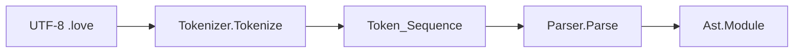

# Compiler parser (minimal program → AST)

#9 — [Compiler parser: minimal program to AST (unit type, entrypoint module)](https://github.com/sanelli/lovelace/issues/9)

Branch: `feature/9-compiler-parser` (linked to #9; created from `main` via `gh issue develop`).

Depends on the landed tokenizer ([#5](https://github.com/sanelli/lovelace/issues/5)). Do **not** implement AST→LIR lowering, IR Generator, CLI wiring, or `lovelace_compiler` → `lovelace_lir` `depends-on`. Frontend AST and types must stay **completely separate** from [`Lovelace.Lir.Modules`](lir/src/lovelace-lir-modules.ads) / [`Subroutines`](lir/src/lovelace-lir-subroutines.ads) / [`Types`](lir/src/lovelace-lir-types.ads).

## Locked decisions

- **Grammar (only accepted form):** `program IDENTIFIER ; begin end .` — six tokens in that order, nothing else.
- **Terminator:** only punctuation **`.`** (`Full_Stop`) after `end`. The earlier `end;` was a typo; **`end;` is a parse error** in this slice.
- **Semicolon** remains required after the program name (`program IDENTIFIER;`).
- **Whitespace:** already stripped by the tokenizer; `program IDENTIFIER;begin end.`, multi-line, and arbitrary Unicode spaces are all valid if the token sequence matches.
- **One compilation unit** = one `.love` file = one parse → one AST module.
- **AST shape:** root module named `IDENTIFIER`; module contains one subroutine also named `IDENTIFIER`; empty body; return type **unit**; subroutine **flags** include both `Export_Flag` and `Entrypoint_Flag` (bitset, not Booleans).
- **Types:** new frontend type system with only **Unit** now; designed so scalars, pointers, enums, unions, structs, arrays, tuples, sum types can be added later without rewriting call sites to a closed LIR-style enum.



## Packages (all under `compiler/src/`)

| Package | File | Role |
| --- | --- | --- |
| `Lovelace.Compiler.Types` | `lovelace-compiler-types.ads` (+ `.adb` if needed) | Frontend type expressions |
| `Lovelace.Compiler.Ast` | `lovelace-compiler-ast.ads` / `.adb` | Module, subroutine, empty statement list |
| `Lovelace.Compiler.Parser` | `lovelace-compiler-parser.ads` / `.adb` | Parse tokens → AST |

Reuse existing [`Source`](compiler/src/lovelace-compiler-source.ads), [`Tokens`](compiler/src/lovelace-compiler-tokens.ads), [`Tokenizer`](compiler/src/lovelace-compiler-tokenizer.ads). No new Alire crate; no pin to `lovelace_lir`.

### Frontend types (`Lovelace.Compiler.Types`)

Discriminated **type expression** (not `Lovelace.Lir.Types.Value_Type`):

```ada
type Type_Kind is (Unit);
--  Later append: Integer, Floating, Character, Named, Pointer, Enum,
--  Union, Struct, Array, Tuple, Sum, …

type Type_Expression (Kind : Type_Kind) is record
   case Kind is
      when Unit =>
         null;
   end case;
end record;

function Unit_Type return Type_Expression;
```

- Keep `Type_Expression` indefinite / variant-ready so future kinds can carry payloads (element type, field lists, etc.).
- Do **not** reuse LIR codes, LIR package names, or LIR flag bitsets.
- `Unit` is for internal use this slice (subroutine return type). No user-facing type syntax yet.

### AST (`Lovelace.Compiler.Ast`)

Distinct names from LIR (`Module` / `Subroutine` live under `Lovelace.Compiler.Ast`, never `with Lovelace.Lir.*`). Do **not** reuse `Lovelace.Lir.Subroutines.Subroutine_Flags`; define a separate frontend flag type with the same bitset shape.

```ada
type Subroutine_Flags is mod 2**32;

Export_Flag     : constant Subroutine_Flags := 2**0;
Entrypoint_Flag : constant Subroutine_Flags := 2**1;

function Has_Export (Flags : Subroutine_Flags) return Boolean;
function Has_Entrypoint (Flags : Subroutine_Flags) return Boolean;
```

- **`Statement_Sequence`**: empty body representation for this slice (count 0); ready to become a statement vector later.
- **`Subroutine`**: name (UTF-8 `Unbounded_String` from identifier lexeme), `Name_Span`, `Filename`, **`Flags : Subroutine_Flags`** (not two Booleans), `Return_Type` (`Types.Type_Expression`), body (`Statement_Sequence`). Accessor `Get_Body` (Ada reserved word `Body` avoided).
- **`Module`**: name + `Name_Span` + `Filename`, spanning `Span` for the whole unit (first token `First` through last token `Last`), ordered `Subroutine_Sequence` with **exactly one** subroutine in this slice.
- Store enough location data that diagnostics can point at the bad token: at least name spans and the module-wide span; copy `Filename` from the identifier (or program) token when present.
- **Revision:** the current Ast on the branch still uses Boolean `Is_Entrypoint` / `Is_Export`; replace those with the bitset API above before implementing the parser.

Accessors for tests and later IR gen: name, `Get_Flags`, `Has_Export` / `Has_Entrypoint`, return type, subroutine count/element, body length, spans.

### Parser (`Lovelace.Compiler.Parser`)

```ada
function Parse
  (Source_Text : String;
   Token_List  : Tokens.Token_Sequence) return Parse_Result;
```

- Caller tokenizes first; parser does **not** call `Tokenize` (keeps layers clear). Tests tokenize then parse.
- `Source_Text` is required so `Tokens.Lexeme` can recover the module/subroutine name.
- **Success only when** `Length (Token_List) = 6` and kinds/subtypes match exactly:

| Index | Expected |
| --- | --- |
| 1 | `Keyword` / `Program_Keyword` |
| 2 | `Identifier` |
| 3 | `Punctuation` / `Semicolon` |
| 4 | `Keyword` / `Begin_Keyword` |
| 5 | `Keyword` / `End_Keyword` |
| 6 | `Punctuation` / `Full_Stop` |

- On success: build module + one subroutine (same name), `Flags => Export_Flag or Entrypoint_Flag`, `Return_Type` = `Unit_Type`, empty body, spans from tokens.
- **Errors:** same shape as the tokenizer — `Parse_Result (Ok)` is AST **or** error list (not both). Mirror [`Tokenize_Result`](compiler/src/lovelace-compiler-tokenizer.ads).

```ada
type Parser_Error_Code is
  (Internal_Error,          -- first (result-and-internal-errors rule)
   Unexpected_End_Of_Input, -- fewer than 6 tokens / ran out mid-expect
   Unexpected_Token,        -- wrong kind or subtype at cursor
   Unexpected_Trailing);    -- more than 6 tokens
```

Prefer checking length and each slot: empty/short → `Unexpected_End_Of_Input` with span of last token if any, else a synthetic span at `(1,1,1)`; wrong token → `Unexpected_Token` at that token’s span; length > 6 → `Unexpected_Trailing` at token 7’s span.

- **Stop at first error** for this rigid grammar (no multi-error recovery). Detail strings like `expected keyword "program", found …` using lexemes when helpful.
- Copy `Filename` from the offending token (or first token) onto the error.
- No `raise`. Handle every `Ok` discriminant.

## Tests (`compiler/tests`)

Add `Lovelace.Compiler.Tests.Parser` and register in [`lovelace-compiler-tests-suite.adb`](compiler/tests/src/lovelace-compiler-tests-suite.adb). Extend support helpers only as needed (`Must_Parse` / `Must_Fail_Parse`).

Cover at least:

- Canonical multiline `program Hello; begin end.`
- One-line / glued forms: `program IDENTIFIER;begin end.`, spaced-out forms with tabs/newlines
- Unicode / `@`-prefixed identifier names (lexeme becomes both module and subroutine name)
- Success assertions: module name, one subroutine, same name, `Has_Export` and `Has_Entrypoint` True, return `Unit`, body length 0, module span covers program…`.`
- Failures: `end;` (semicolon after end), wrong order, missing tokens, extra tokens, `Program` as keyword position (identifier not keyword), empty token list

## Docs

- Add [`docs/parser.md`](docs/parser.md): API, grammar, AST/type separation from LIR, error codes.
- Add [`docs/program-grammar.md`](docs/program-grammar.md) (or extend token-grammar): EBNF for this compilation-unit slice.
- Update [`docs/tokenizer.md`](docs/tokenizer.md) intro: parser now exists; link to parser docs.
- Touch [`README.md`](README.md) only if it still claims “no parser”.

## Out of scope

- IR Generator / AST→LIR
- More statements, types, keywords, comments, directives
- Shared diagnostic pretty-printer (`error[L…]` format)
- CLI / `lovelace` depends-on changes beyond what already exists for the compiler crate

## Implementation envelope

TODOs are 1:1 with these steps (same numbers, same meaning).

1. Create a GitHub issue with `gh issue create` (title/body for compiler parser + minimal AST); record `#9`. Reuse if an equivalent open issue exists. **Done:** https://github.com/sanelli/lovelace/issues/9
2. Sync `main`, then `gh issue develop 9 --name feature/9-compiler-parser --checkout --base main`. Verify with `gh issue develop --list 9`. **Done:** branch linked and checked out.
3. Save this plan as [`.cursor/plans/9-compiler-parser.plan.md`](.cursor/plans/) with `#9` in the body. **Done.**
4. Implement `Lovelace.Compiler.Types` (Unit-only extensible `Type_Expression`). **Done.**
5. Implement `Lovelace.Compiler.Ast` (module, subroutine, empty statements, `Subroutine_Flags` bitset, spans). **In progress / revise:** replace Boolean `Is_Entrypoint` / `Is_Export` with `Subroutine_Flags` (`Export_Flag`, `Entrypoint_Flag`, `Has_Export`, `Has_Entrypoint`).
6. Implement `Lovelace.Compiler.Parser` (`Parse`, error codes, exact six-token grammar ending in `.`).
7. Add AUnit parser tests and suite registration; run `gnatformat` on all touched Ada files.
8. Write/update docs (`parser.md`, program grammar, tokenizer cross-links).
9. Run all existing tests (`lovelace_workspace` / nested crates that exist, including `compiler/tests` and `common/tests` / `lir/tests` as applicable).
10. Push (proxy env cleared) and open a PR with `gh pr create`.
